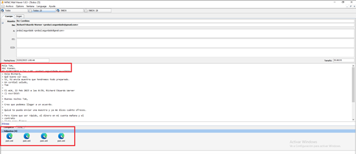
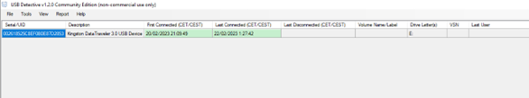
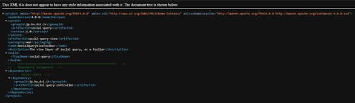

# Unfaithful Employee

**Fecha:**   
29 de Enero de 2025 

**Peritos:**   
*Yeray Almoguera Gonzalez*   
*Álvaro Caro Fernández*   
*Angel Alberto Martinez Sanchez*   
*Rafael Tocino Batista*   
Gonzalo Pulido Sanchez  

 

# Índice
- [Palabras clave](#palabras-clave)  
- [Resumen ejecutivo](#resumen-ejecutivo)  
- [Introducción](#introducción)  
   - [Antecedentes](#antecedentes)  
   - [Objetivos](#objetivos)  
- [Fuentes de información](#fuentes-de-información)  
   - [Comprobación de la integridad](#comprobación-de-la-integridad)  
- [Análisis](#análisis)  
   - [Entorno de trabajo y herramientas utilizadas](#entorno-de-trabajo-y-herramientas-utilizadas)  
   - [Procesos](#procesos)  
      - [Análisis de correo electrónico](#analisis-de-correo-electrónico)  
      - [Análisis de USB](#análisis-de-usb)  
      - [Análisis de archivos](#análisis-de-archivos)  
- [Conclusiones](#conclusiones)  
- [Anexo 1. Juramento y Tacha](#anexo-1-juramento-y-tacha)  
- [Anexo 2. Hallazgos](#anexo-2-hallazgos)  
- [Anexo 4. Línea Temporal](#anexo-4-línea-temporal)  

 

# **Palabras clave**

**- Hash:** Es un valor único generado mediante una función matemática a partir de los datos. Si los datos cambian, también lo hará el valor hash, lo que permite verificar su integridad y que no ha sido modificado.

**- USB Detective:** Herramienta que permite rastrear la conexión y uso de dispositivos USB en un sistema. Ayuda a identificar cuándo y qué dispositivos fueron conectados a un ordenador, lo que es útil para investigar posibles fugas de información.

**- Autopsy:** Software de análisis forense utilizado para examinar discos duros y otros dispositivos de almacenamiento. Permite recuperar archivos eliminados, analizar la estructura del sistema de archivos y buscar evidencia relacionada con actividades sospechosas.

**- FTK Imager:** Herramienta utilizada para crear copias exactas de discos duros y otros dispositivos de almacenamiento. También permite analizar estos dispositivos sin alterar la evidencia original, incluso si los discos están dañados o tienen sectores corruptos.

**- pom.xml:** Archivo utilizado en proyectos de software Java. Su presencia puede indicar el uso indebido de datos de un proyecto para la fuga de información.

**- MiTeC Mail View:** Software utilizado para examinar correos electrónicos almacenados en formatos de clientes de correo como Outlook o Thunderbird.

 

---

# **Resumen ejecutivo**

Tras una exhaustiva investigación forense digital, este informe recoge los hallazgos clave derivados del análisis del disco duro de Richard Eduardo Warner, ex empleado de InnovaTech Solutions. En un momento crítico para la empresa, marcada por ambiciosos desarrollos tecnológicos y crecientes rumores de inestabilidad financiera, las sospechas sobre el accionar de Warner han obligado a tomar medidas para garantizar la seguridad de la información corporativa.

Este análisis busca determinar si hubo filtración de datos confidenciales, uso indebido de los recursos de la compañía o cualquier otra actividad que pudiera comprometer la integridad de los proyectos estratégicos de InnovaTech. A partir de un meticuloso examen de registros, archivos y posibles intentos de evasión de seguridad, este informe ofrece una visión detallada sobre las acciones del ex empleado y sus posibles implicaciones para la empresa.

 

---

# **Introducción**
## Antecedentes

En el contexto de una investigación interna en InnovaTech Solutions, relacionada con posibles acciones perjudiciales por parte de Richard Eduardo Warner, un empleado de la empresa, se ha procedido a la incautación y análisis forense de su disco duro. Richard, quien hasta ahora había demostrado ser un empleado ejemplar, ha exhibido recientemente comportamientos inusuales, incluyendo una confrontación con su superior y una salida abrupta de la empresa, lo que ha levantado sospechas sobre sus motivaciones y posibles amenazas hacia la seguridad y los intereses de la compañía.

Este dispositivo fue asegurado y clonado siguiendo los procedimientos establecidos para preservar la cadena de custodia y evitar la alteración de la información contenida en él. Posteriormente, la imagen forense del disco fue remitida a un laboratorio especializado para su análisis exhaustivo. El objetivo del análisis es identificar y documentar cualquier hallazgo relacionado con el uso inapropiado de los recursos de la empresa, filtraciones de información confidencial, o cualquier otra actividad que pueda comprometer la seguridad y el futuro de InnovaTech Solutions.

## Objetivos

Los objetivos principales de este informe son: 

* Examinar la imagen forense del disco duro incautado para identificar información relacionada con la planificación y ejecución del atentado.   
* Documentar las metodologías, herramientas y técnicas utilizadas durante el análisis, asegurando la reproducibilidad de los resultados.   
* Presentar los hallazgos clave, incluyendo datos sobre usuarios, archivos, búsquedas y patrones de actividad. 

 

---

# **Fuentes de información**

La imagen forense del disco duro fue proporcionada por Alan, del departamento de sistemas. Que realizó la adquisición de los hallazgos bajo los estándares legales y técnicos correspondientes. La fuente principal de información es la imagen forense obtenida del disco duro decomisado, con las siguientes características:

| Sistema y versión del sistema operativo | Windows ProfessionalEducationN |
| :---: | :---: |
| **Nombre del usuario y organización registrado** | Richard |
| **Product ID**  | 00378-50000-00001-AA619 |
| **Fecha de instalación** | 20/02/2023 18:30:01 |
| **Nombre de la máquina** | LADRONERA |
#### *Información 1. Datos de la máquina*

---

## Comprobación de la integridad

La imagen forense analizada es una copia exacta, íntegra y no contaminable del contenido del disco duro original decomisado. El proceso de adquisición siguió los protocolos establecidos para garantizar la integridad de la imagen, preservando la autenticidad mediante la verificación de valores hash:

| ORIGINAL |  |
| :---: | :---- |
| **MD5** | dfdfba2231e3fa409676b1b737474208 |
| **SHA-1** | f476a81089a10f9d5393aa8c2f8bbccdb87f7d3c |
| **SHA-256** | 66d6ee7a61ea7a986e8f6bb54b9986f79d95b5a0278bef86678ed42ace320d96 |
| **CALCULADO** |  |
| **MD5** | dfdfba2231e3fa409676b1b737474288 |
| **SHA-1** | f476a81089a10f9d5393aa8c2f8bbccdb87f7d3c |
| **SHA-256** | 66d6ee7a61ea7a986e8f6bb54b9986f79d95b5a0278bef86678ed42ace320d9b |

#### *Información 2. Tabla de Hashes*

Podemos notar que los valores hash proporcionados no coinciden con los que hemos calculado de manera independiente. Esto indica una posible discrepancia en los datos, que podría deberse a diferencias en el método de generación, errores en la transmisión de información o posibles modificaciones en los archivos analizados.

 

---

# **Análisis**

## Entorno de trabajo y herramientas utilizadas

El análisis de los hallazgos se llevó a cabo en un entorno controlado, utilizando una máquina virtual con sistema operativo Windows 10 para garantizar la seguridad y el aislamiento durante el proceso, empleando herramientas especializadas que permitieron examinar, recuperar y verificar la integridad de los datos contenidos en el disco duro incautado. Las herramientas empleadas en este trabajo son: 

* **Windows Registry Recovery (v. 1.6.1.0):** Aplicada para extraer y analizar registros clave del sistema operativo Windows, identificando usuarios, actividades recientes y configuraciones relevantes relacionadas con el caso.

* **USB Detective (v.1.2.0):** Herramienta diseñada para analizar el historial de dispositivos USB conectados a un sistema. Permite identificar información clave como la fecha y hora de conexión, número de serie, fabricante y tipo de dispositivo, lo que resulta útil en investigaciones forenses para rastrear el uso de dispositivos extraíbles en un equipo.

* **Autopsy (v.4.2.0):** Utilizada para analizar la estructura del sistema de archivos, recuperar archivos eliminados y examinar registros del sistema operativo, proporcionando una visión detallada de la actividad en el dispositivo. 

* **FTK Imager (v.4.2.0.13):** Aplicación utilizada para la adquisición y análisis forense de imágenes de discos duros, dispositivos extraíbles y otros medios de almacenamiento. Permite la creación de copias forenses sin alterar la evidencia original, además de ofrecer funciones para la visualización y extracción de archivos, incluso en discos dañados o con sectores corruptos.

* **MiTeC Mail View (v.1.8.5):** Software especializado en la visualización y análisis de correos electrónicos almacenados en formatos como Outlook PST/OST y Thunderbird. Facilita la extracción de información relevante, incluyendo remitentes, destinatarios, fechas y archivos adjuntos, lo que lo convierte en una herramienta esencial para la investigación de comunicaciones electrónicas en casos forenses.

---

## Procesos

### Analisis de Correo Electrónico

Durante la investigación forense de InnovaTech Solutions, se examinó el historial de correos electrónicos de Richard Eduardo Warner utilizando el cliente Thunderbird y el software MiTeC Mail View. Se identificaron múltiples intercambios entre Richard y un tercero externo, Tom, en los cuales se negociaba la entrega de información confidencial de la empresa a cambio de una compensación económica.

El análisis revela que Richard envió inicialmente una "muestra" en forma de un archivo pom.xml, lo que sugiere una intención deliberada de filtrar información. Posteriormente, se confirmó la entrega de un enlace de Google Drive con más datos, protegido con contraseña, la cual fue proporcionada tras la recepción del pago en Bitcoin.

Estos hallazgos evidencian un esquema de exfiltración de datos a través del correo electrónico, destacando la necesidad de reforzar las políticas de seguridad y monitoreo de la comunicación corporativa.

| Fecha / Hora: | 22/02/2023 1:06:44 |
| :---- | :---- |
| **De:** | proba1.seguridade@gmail.com |
| **A:** | proba2.seguridade@gmail.com |
|  |  |
#### *Hallazgo 1\. Correo electrónico*

---

### Análisis de USB

Tras un análisis exhaustivo del sistema de InnovaTech Solutions, se ha identificado que Richard Eduardo Warner hizo uso de un dispositivo USB, a pesar de que las políticas de seguridad de la empresa prohíben estrictamente el uso de estos dispositivos para evitar riesgos de fuga de información o compromisos de seguridad. Este hallazgo plantea serios interrogantes sobre el cumplimiento de las normativas internas y sobre posibles intentos de manipular o transferir información de manera no autorizada.

Para profundizar en la investigación, se han analizado los artefactos digitales asociados con el uso del dispositivo USB en cuestión.

| Kingston Data Traveler 3.0 |  |
| :---: | :---- |
| **Ruta** | /ControlSet001/Enum/USBSTOR |
| **Serial/UID** | 002618525C8EF0B0E87D2853&0 |
| **First connected** | 20/02/2023 21:09:49 |
| **Last Connected** | 22/02/2023 01:27:42 |
|  |  |
#### *Hallazgo 2. USB*

---

### Análisis de Archivos

Durante el análisis forense de InnovaTech Solutions, se identificó que Richard Eduardo Warner envió un archivo pom.xml a través de correo electrónico como parte de una posible exfiltración de datos. Este archivo, ubicado en la ruta C:\\Users\\Richard\\Proyectos\\reverb-master\\reverb-master\\models\\pom.xml, pertenece a un proyecto Java (reverb-master) y contiene referencias a un repositorio en GitHub.

El envío de este archivo, junto con las conversaciones extraídas del cliente de correo Thunderbird mediante MiTeC Mail View, refuerza la hipótesis de una filtración deliberada de información. La muestra enviada formaba parte de una negociación ilícita, donde Richard acordó la entrega de más datos a cambio de una compensación económica.

| pom.xml |  |
| ----- | :---- |
| **Extensión** | .xml |
| **Ruta** | C:\Users\Richard\Proyectos\reverb-master\reverb-master\models\pom.xml |
| **Hash MD5** | D174C59F6048DC03480FA600D22F85C4 |
|  |  |
#### *Hallazgo 3. Archivo XML*

 

---

# **Conclusiones**

Basándonos en los hallazgos obtenidos durante el análisis, se puede decir que Richard, el ex empleado de InnovaTech Solutions, estuvo involucrado en actividades ilícitas que comprometieron la seguridad de la información corporativa de la empresa. Los datos recopilados muestran que, a pesar de las políticas estrictas de la compañía sobre el uso de dispositivos externos y la protección de datos confidenciales, Richard violó estas normativas mediante la exfiltración de información sensible.

Estos actos no solo constituyen una violación directa de la política de seguridad de la empresa, sino que también suponen una amenaza grave para la integridad y el futuro de los proyectos de InnovaTech Solutions. Los hallazgos sugieren que Richard Eduardo Warner estaba llevando a cabo un esquema organizado de exfiltración de datos, lo que plantea serias implicaciones legales y de seguridad para la organización.

 

---

# **Anexo 1. Juramento y Tacha.**

Este apartado incluye el juramento en relación con su imparcialidad y la declaración formal sobre posibles impedimentos o tachas, cumpliendo con los requisitos legales establecidos.

[Enlace a la información sobre Juramento y Tacha](https://docs.google.com/document/d/1TaEmFrThwr-PI5OsDhm50XKKiMOp-GJt_pocApEhhZM/edit?tab=t.0#heading=h.n7dnf9wf0eos)

 

---

# **Anexo 2. Hallazgos.**

En este anexo se detallan los hallazgos obtenidos, incluyendo descripciones precisas de los archivos relevantes, su contexto en la investigación y cualquier proceso realizado durante su análisis.

[Enlace a los hallazgos obtenidos](https://docs.google.com/document/d/1X4G8CXMboYuIJeQfau1fIPgv6lULqjwnListMqHY8D0/edit?usp=sharing)

 

---

# **Anexo 4. Línea Temporal.**

En este anexo se detalla la línea temporal de los eventos relacionados con las actividades del sospechoso, proporcionando una visión estructurada y cronológica de los hechos clave. La información presentada se basa en los datos recopilados durante la investigación, incluyendo archivos analizados y otros elementos relevantes con el historial de búsqueda.

Cada evento incluye la fecha y hora (cuando están disponibles), una breve descripción, y su relevancia para la investigación. Esta línea temporal es fundamental para comprender el comportamiento y las posibles intenciones del sospechoso.

[Enlace a la línea temporal](https://drive.google.com/file/d/1Fu7Kqj1mBPx2Qse7wVy_I-T4I9wD8qHz/view?usp=sharing)