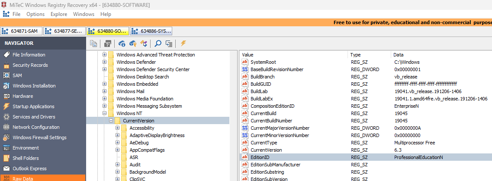
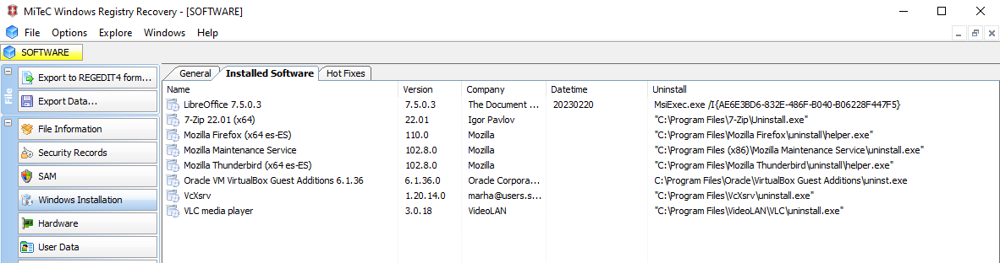

# Respuestas a las preguntas

# 1. Verificar la integridad de la imagen del disco a través de CMD o PowerShell, comparando los hashes proporcionados. ¿Coinciden los tres hashes?

Se ha realizado la verificación de integridad de la imagen del disco mediante la comparación de los hashes obtenidos con los valores originales proporcionados. Se calcularon los hashes utilizando los algoritmos MD5, SHA-1 y SHA-256.

A continuación, se presentan los resultados:

### MD5

| HASH ORIGINAL       | dfdfba2231e3fa409676b1b737474208 |
|---------------------|----------------------------------|
| HASH CALCULADO      | dfdfba2231e3fa409676b1b737474288 |

### SHA-1

| HASH ORIGINAL       | f476a81089a10f9d5393aa8c2f8bbccdb87f7d3c |
|---------------------|----------------------------------|
| HASH CALCULADO      | f476a81089a10f9d5393aa8c2f8bbccdb87f7d3c |

### SHA-256

| HASH ORIGINAL       | 66d6ee7a61ea7a986e8f6bb54b9986f79d95b5a0278bef86678ed42ace320d96 |
|---------------------|----------------------------------|
| HASH CALCULADO      | 66d6ee7a61ea7a986e8f6bb54b9986f79d95b5a0278bef86678ed42ace320d9b |

Se observa una discrepancia en los valores de los hashes MD5 y SHA-256, lo que indica una posible alteración en los datos, ya sea por errores en la transmisión, diferencias en el método de generación o modificaciones en los archivos analizados.

 
 

# 2.Confirmar la existencia de un usuario correspondiente a Richard en el equipo y determinar cuándo fue su último inicio de sesión.

Se extrajeron los archivos SAM, SECURITY, SOFTWARE y SYSTEM desde la ruta C:/Windows/System32/config utilizando la herramienta FTK. Posteriormente, se utilizó Windows Registry Recovery para analizar el archivo SAM.

La evidencia confirma la existencia de un usuario llamado "Richard", con un último inicio de sesión registrado el 22/02/2023 a las 13:55:18.

Como vemos en la imagen, si que existe un usuario llamado Richard y tenemos acceso a la informacion de su ultimo inicio de sesion (22/02/2023 13:55:18)

 
 

# 3.Identificar el nombre del equipo y la versión del Sistema Operativo utilizado.

Para determinar estos datos, se analizaron los archivos SYSTEM y SOFTWARE utilizando Windows Registry Recovery.

### Nombre del equipo
  
Ubicado en la ruta `/ControlSet001/Control/ComputerName/ComputerName` dentro del archivo SYSTEM. El nombre del equipo es "LADRONERA".

  El nombre del sistema es `LADRONERA`

### Version del sistema
  
Ubicada en la ruta /Microsoft/Windows NT/CurrentVersion dentro del archivo SOFTWARE. Se determinó que el sistema operativo es "ProfessionalEducationN".

 
 

# 4.Investigar si se introdujo algún dispositivo USB en el equipo, a pesar de las políticas de la empresa contra su uso por parte de Richard. En caso afirmativo, especificar los detalles del dispositivo USB y el momento de su conexión.

A pesar de las políticas de la empresa que prohíben el uso de dispositivos USB, se detectó la conexión de un dispositivo USB mediante el análisis del archivo SYSTEM con Windows Registry Recovery. Se accedió a la sección "Hardware" y se verificó la presencia del dispositivo en la opción "LastKnownGood".

Para obtener más detalles, se utilizó USB Detective, analizando los archivos SYSTEM y SOFTWARE, lo que permitió determinar el momento exacto de conexión del dispositivo.

 
 

# 5.Dado el interés conocido de Richard por el fútbol y la música rock y heavy, investigar su actividad en línea relacionada con estos intereses. Además, verificar si ha visualizado contenido en línea que pueda justificar un despido procedente, como la visualización de una película online. Documentar cualquier hallazgo relevante.

Usando Autopsy para la visualizacion de busquedas en internet, se ha encontrado busquedas de una pelicula llamada Trabajo Basura, tambien busquedas de Cuevana y de compras en amazon.

Otras busquedas relevantes son eToro (Una popular pagina de inversiones), compras en Bershka y la visualizacion de un video en Youtube.

 
 

# 6.Determinar si, tras su salida de la empresa, Richard tenía planes de visitar otro lugar y, de ser así, cómo planeaba llegar allí.

 
 

# 7.Comprobar si existe algún navegador web, aparte de los proporcionados por Microsoft, configurado para ejecutarse al iniciar sesión Richard.

Podemos comprobar si existe algún navegador web instalado a demás de los proporcionados por Microsoft, podemos indagar en el registro SOFTWARE de nuevo y ver todos los programas que tiene instalado en el equipo:

También podemos ver que aunque tiene varios navegadores web instalados en el equipo, el único habilitado para que se inicie al ejecutarse el equipo es Opera.

Esto podemos descubrirlo desde los registros del usuario, en el archivo NT.USERDAT en la ruta `\Software\Microsoft\Windows\CurrentVersion\Run`:

 
 

# 8.Buscar evidencia de que Richard haya asistido a competidores o terceros mediante la exfiltración de datos por correo electrónico.

Se puede verificar, a través del historial de conversaciones en el cliente de correo electrónico Thunderbird, que el supuesto sospechoso, Richard, con la dirección de correo proba1.seguridade@gmail.com, ha mantenido una comunicación con una posible empresa competidora, cuyo correo es proba2.seguridade@gmail.com, en la que ha compartido información confidencial de la empresa.

Esta información es accesible desde el historial del mismo cliente, almacenado en la siguiente ruta: `C:\Users\Richard\AppData\Roaming\Thunderbird\Profiles\tvtlv94f.default-release\`

Al montar esta carpeta en el software MiTeC Mail View, fue posible examinar el historial de conversaciones de Richard.

El primer correo que vemos es de Richard hablando con Tom sobre su futuro contrato en la emprea pero aparte se menciona algo que tienen entre manos sobre un operacion que debe de ser recompensada.

El segundo correo es de Tom hacia Richard, en este hablan sobre que le parece bien la subidad de sueldo, pero sobre esa operacion de la que antes mencionaban que dependiendo de lo que ofresca podria llevar una recompensa u otra.

En este correo que envia Richard a Tom dos dias despues, Richar ofrece a Tom una muestra de lo que podria ser la exfiltración de datos.

En este correo se puede ver como Tom acepta esta porpuesta de enviarle una pequeña muestra.

Por lo que en el siguiente correo Richard le envia un archivo `pom.xml` que veremos en detalle.

Haciendo una búsqueda sobre el archivo, podemos comprobar que se encuentra dentro de un proyecto, el archivo parece contener datos de un proyecto y el enlace a un repositorio de github del mismo.

Ruta del archivo: `C:\Users\Richard\Proyectos\reverb-master\reverb-master\models\pom.xml`

En este corro Tom le habla a Richard sobre las muestras que le ha enviado, y le comenta que le parece todo correcto y que le podrian ofrecer 100K pero en Bitcoin, ya que por transferencia bancaria dice que "cantaria demasiado".

Ya en este correo Richard envia un elace de Google Drive con todos los datos que le quiere vender a Tom, pero le dice que esta protegido con contraseña y que si la quiere tiene que pagar en una cartera en Bitcoin.

En este correo Tom le piede a Richard la contraseña del archivo que ya le ha enviado el dinero.

En este ultimo correo vemos que Richard le envia la contraseña a Tom.

