# Anexos del informe

## Anexo 1

En este anexo se muestran los hashes de los archivos de volcado de memoria, que aseguran la integridad de los datos adquiridos.

*Hash de DESKTOP-01S7HH9-20220408-171552.dmp.zip*

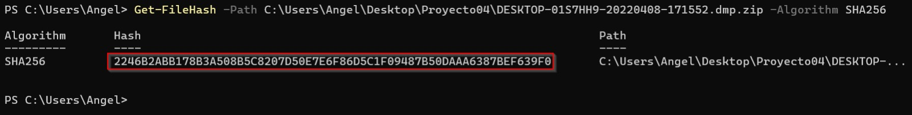

*Hash de DESKTOP-01S7HH9-20220408-171552.dmp*

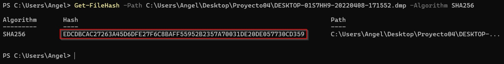

*Hash de DESKTOP-01S7HH9-20220408-171552.json*

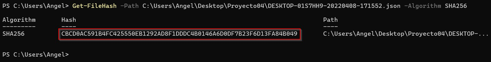

 

## Anexo 2 

"Se verificó el nombre del equipo 'DESKTOP-01S7HH9' utilizando la herramienta sysinfo, confirmando que correspondía al dispositivo del sospechoso.

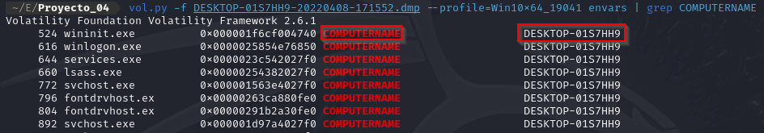

 

## Anexo 3 

Se identificó el proceso **AcroCEF.exe**, lo que indica que Adobe Acrobat o Reader estaba instalado y en uso en el sistema.

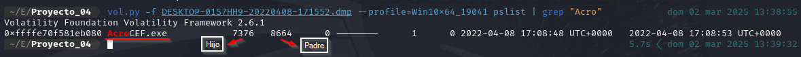

 

## Anexo 4

Mediante el análisis de la MFT y el plugin **handles**, se determinó que el archivo 'Trabajo historia Pacopepe.odt' estaba siendo editado en el momento de la intervención.

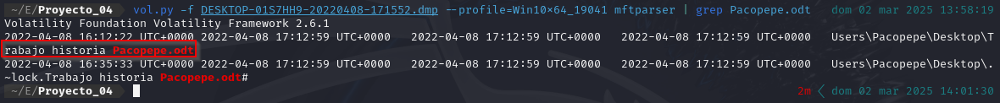

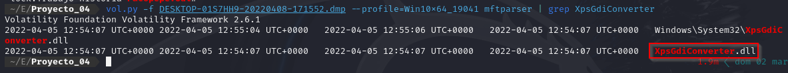

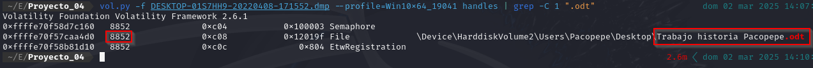

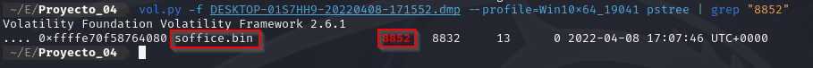

 

## Anexo 5

Se encontró una conversación en Discord en la que *“pakopepe88”* admitía ser el autor de la amenaza de bomba, respaldada por los resultados de la búsqueda de “**bomba**” en la memoria volcada.

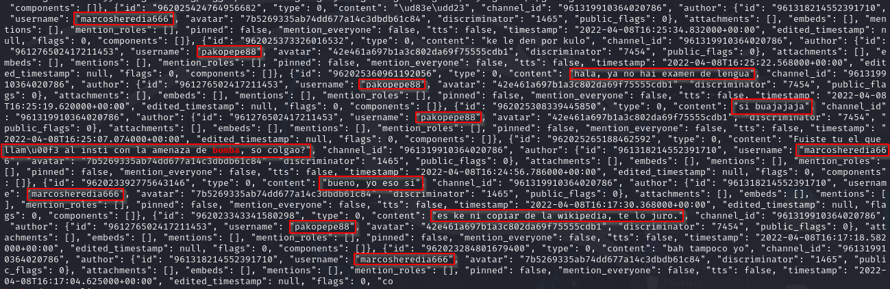

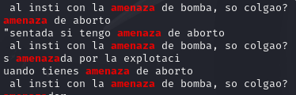

