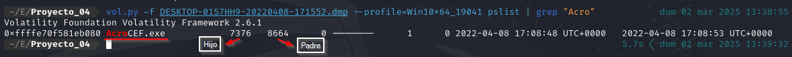
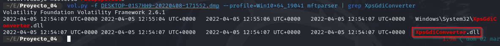
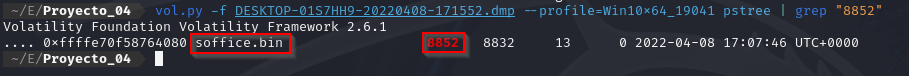
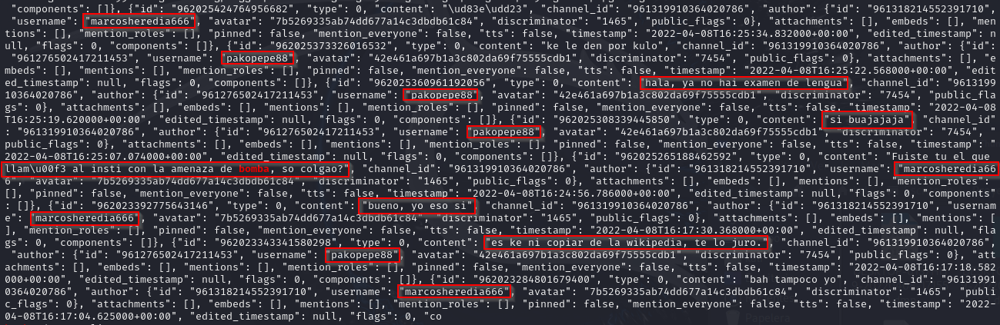
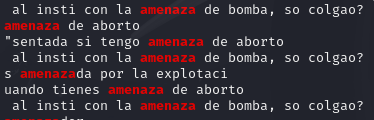

# Investigación del incidente

<br>

## Confirmar si la imagen de memoria pertenece al ordenador del alumno, identificado como "DESKTOP-01S7HH9".

Para confirmar la propiedad del dispositivo de almacenamiento, hemos empleado la herramienta "*sysinfo*" de SysInternals. Esta utilidad nos proporciona un informe detallado sobre la configuración del sistema, incluyendo el nombre del equipo asociado a cada proceso en ejecución. De esta manera, podemos identificar con precisión el origen de las operaciones en curso.


Como vemos en la imagen el nombre del equipo concuerda con el del alumno.

<br>

## Determinar el PID del proceso de la aplicación utilizada para visualizar documentos PDF y establecer cuál es su proceso padre.

Al analizar los procesos del sistema, se observa la presencia de **AcroCEF.exe**, un componente de Adobe Acrobat que gestiona funcionalidades específicas como la conversión de páginas web a PDF y la interacción con servicios en la nube. Aunque no es un lector de PDF directo, su presencia indica que Adobe Acrobat o Reader está instalado y posiblemente en ejecución.



<br>

## A través de los manejadores, identificar qué documento estaba siendo editado por el alumno durante la intervención policial.

El análisis de la MFT reveló que el PDF encontrado se originó a partir de un archivo .odt, gracias a la evidencia de la descarga y uso de una herramienta de conversión. Esto sugiere que el usuario convirtió el archivo original a formato PDF utilizando dicha herramienta.




El documento "*Trabajo historia Pacopepe.odt*" estaba siendo editado, según se observó mediante el plugin "**handles**", que lista los manejadores de objetos del sistema utilizados por procesos específicos. Esto indica que el archivo estaba abierto y posiblemente en edición en el momento de la captura.

  


<br/>

## Buscar en el volcado de memoria pruebas que vinculen al usuario del equipo con la realización de la falsa amenaza de bomba.

Primero, se convirtió el archivo de volcado de memoria a un formato raw utilizando Volatility, ya que el plugin "**strings**" requiere un espacio de direcciones de memoria raw:

```bash
vol.py -f DESKTOP-01S7HH9-20220408-171552.dmp --profile=Win10x64_19041 imagecopy -O raw_memory.dd
```

Luego, se generó un archivo de strings a partir del archivo raw utilizando el comando strings de Linux:

```bash
strings raw_memory.dd > strings.txt
```

A continuación, se buscó la palabra "bomba" en el archivo de strings para encontrar posibles evidencias:

```bash
grep bomba strings.txt
```

Durante el análisis, se identificó una conversación en Discord entre los usuarios "*pakopepe88*" y "*marcosheredia666*", donde "pakopepe88" admite ser el autor de la amenaza de bomba falsa. Esta evidencia fue crucial para vincular al usuario con el incidente.



