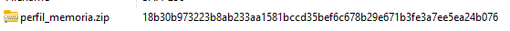
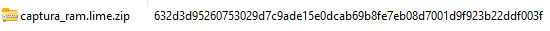
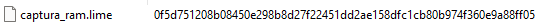
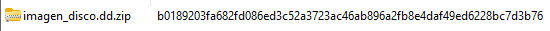
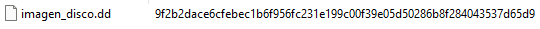
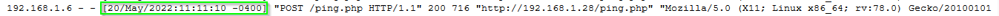

# Investigación del Incidente

## Comprobación de Hashes

En primer lugar vamos a hacer una comprobación de los diferentes hashes proporcionado:

| **Archivo**                        | **Hash Proporcionado**                                                      | **Hash Comprobado** |
|------------------------------------|-----------------------------------------------------------------------------|----------------------|
| metasploitable2_perfil_memoria.zip | 18b30b973223b8ab233aa1581bccd35bef6c678b29e671b3fe3a7ee5ea24b076            |  |
| captura_ram.lime.zip               | 632d3d95260753029d7c9ade15e0dcab69b8fe7eb08d7001d9f923b22ddf003f            |  |
| captura_ram.lime                   | 0f5d751208b08450e298b8d27f22451dd2ae158dfc1cb80b974f360e9a88ff05            |  |
| imagen_disco.dd.zip                | b0189203fa682fd086ed3c52a3723ac46ab896a2fb8e4daf49ed6228bc7d3b76            |  |
| imagen_disco.dd                    | 9f2b2dace6cfebec1b6f956fc231e199c00f39e05d50286b8f284043537d65d9            |  |

## **1. Identificar la vulnerabilidad en la aplicación web que fue explotada por el atacante**

Se detectó una vulnerabilidad crítica en el archivo `ping.php`, alojado en un servidor Apache. Este archivo, desarrollado en PHP, permite la ejecución de comandos arbitrarios debido a una falla de inyección de código. La vulnerabilidad está relacionada con el **CVE-2023-6895**, que describe características similares. 

El análisis de los registros del servidor confirmó la explotación de esta falla mediante solicitudes **POST** maliciosas. Estas solicitudes permitieron al atacante ejecutar comandos como la extracción del contenido del archivo `/etc/passwd`, que fue almacenado en un archivo denominado `passwd.txt`.

**Ruta del archivo vulnerable:** `/var/www/ping.php`

---

## **2. Determinar la IP, el cliente y el sistema operativo utilizado por el atacante durante el ataque**

La investigación de los registros del servidor Apache, ubicados en `/var/log/apache2/access.log`, reveló información sobre el origen del ataque:

- **Dirección IP:** 192.168.1.6  
- **Sistema Operativo:** Linux x86_64  
- **Cliente:** Mozilla Firefox  

Los registros muestran actividad sospechosa que coincide con las solicitudes maliciosas realizadas durante el incidente.

---

## **3. Descubrir qué datos fueron exfiltrados del servidor comprometido**

El atacante utilizó el archivo vulnerable `ping.php` para ejecutar comandos que extrajeron información sensible del sistema. Esto resultó en la creación de un archivo llamado `passwd.txt`, almacenado en la misma ruta del servidor web (`/var/www`). Este archivo contenía datos extraídos directamente del archivo `/etc/passwd`, el cual incluye información sobre las cuentas de usuario del sistema.

Además, los metadatos del archivo `passwd.txt` coinciden con las marcas temporales registradas durante el ataque, confirmando su relación directa con la actividad maliciosa.

---

## **4. Analizar por qué el archivo original no muestra actividad durante el incidente**

El archivo original `/etc/passwd` no muestra signos de modificación porque únicamente fue leído mediante un comando como `cat`. El atacante copió su contenido y lo almacenó en un nuevo archivo (`passwd.txt`) sin alterar ni mover el archivo original. Este tipo de interacción no genera cambios en los metadatos ni evidencia directa de actividad en el fichero original.

---

## **5. Proponer soluciones para reparar la vulnerabilidad explotada**

Para prevenir futuros incidentes similares, se pueden implementar las siguientes medidas:

- **Validación y sanitización de entradas:** Asegurar que todas las entradas de usuario sean verificadas para evitar inyecciones de código.
- **Actualización continua:** Aplicar parches de seguridad y mantener actualizado tanto el sistema operativo como las aplicaciones instaladas.
- **Restricción de permisos:** Configurar privilegios mínimos para los usuarios que ejecutan aplicaciones, evitando accesos innecesarios a archivos sensibles.
- **Implementación de un Web Application Firewall (WAF):** Utilizar un WAF para analizar y bloquear tráfico malicioso en tiempo real.
- **Pruebas de seguridad:** Realizar análisis periódicos utilizando herramientas como OWASP ZAP para identificar vulnerabilidades antes del despliegue.
- **Fortalecimiento de contraseñas:** Establecer políticas robustas para contraseñas y actualizar las existentes si no cumplen con estándares adecuados.