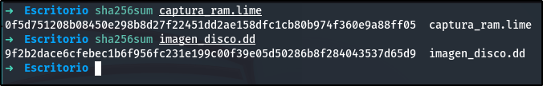
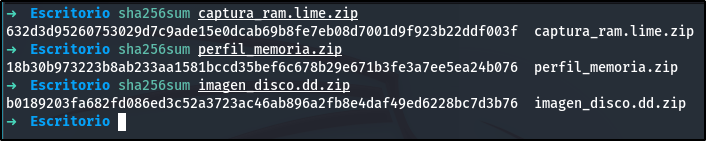

# Informe Incident on Linux Server I

 

**Fecha:**  
Miércoles, 26 de marzo de 2025

**Autores:**  
*Yeray Almoguera González*  
*Ángel Martínez Sánchez*  
*Álvaro Caro Fernández*  
*Gonzalo Pulido Sánchez*  
*Rafael Tocino Batista*  

--- 

## Índice

  - [Palabras claves](#palabras-claves)
  - [Resumen ejecutivo](#resumen-ejecutivo)
  - [Introducción](#introducción)
    - [Antecedentes](#antecedentes)
    - [Alcance](#alcance)
    - [Objetivos](#objetivos)
  - [Fuentes de información](#fuentes-de-información)
    - [Comprobación de los hashes](#comprobación-de-los-hashes)
  - [Analisis](#analisis)
    - [Entorno de trabajo y herramientas utilizadas.](#entorno-de-trabajo-y-herramientas-utilizadas)
    - [Procesos](#procesos)
  - [Conclusiones](#conclusiones)
  - [Anexos](#anexos)
    - [Anexo 1. Hallazgos](#anexo-1-hallazgos)
    - [Anexo 2. Cadena de custodia](#anexo-2-cadena-de-custodia)
    - [Anexo 3. Metodología](#anexo-3-metodología)
    - [Anexo 4. Declaración juramento y tacha](#anexo-4-declaración-juramento-y-tacha)
 

## Palabras claves

* **Inyección de comandos:** Vulnerabilidad que permite a un atacante ejecutar comandos arbitrarios en el sistema operativo subyacente a través de una aplicación web.  
* **/etc/passwd**: Archivo del sistema operativo Linux que contiene información sobre las cuentas de usuario, como nombres de usuario, identificadores y rutas al directorio de inicio.  
* **Web Application Firewall (WAF)**: Dispositivo de seguridad que analiza el tráfico HTTP/HTTPS para proteger las aplicaciones web de ataques, filtrando y bloqueando solicitudes maliciosas.  
* **Metadatos**: Información que describe los datos, proporcionando detalles sobre el origen, la fecha de creación, el tamaño y otras características de un archivo.  
* **MAC Time**: Se refiere a los atributos de tiempo de un archivo: Modificación, Acceso y Creación.

 

## Resumen ejecutivo

Este informe detalla la investigación de un incidente de seguridad en un servidor web Apache. Se identificó una vulnerabilidad de inyección de comandos en el archivo "ping.php", explotada por un atacante desde la IP 192.168.1.6. El ataque resultó en la exfiltración del contenido del archivo /etc/passwd, almacenado en un nuevo archivo "passwd.txt". La investigación reveló el método de ataque, los datos comprometidos y la falta de modificación del archivo original. Se proponen medidas de seguridad, incluyendo la implementación de un WAF y mejoras en la validación de entradas, para prevenir futuros incidentes. Este resumen proporciona una visión general completa del incidente, sus implicaciones y las acciones recomendadas.

 

## Introducción

### Antecedentes

Un técnico llamado Vicente recibió una notificación sobre un posible incidente de seguridad que involucra la filtración de datos sensibles a través de una aplicación web aparentemente segura, diseñada para realizar escaneos de red remotos. Esta notificación desencadenó una investigación exhaustiva para determinar la naturaleza y el alcance del incidente.

---

### Alcance

La investigación abarca el análisis completo de la imagen del disco del equipo afectado y un volcado de su memoria RAM. Se busca identificar y analizar el rastro dejado por el intruso, determinar la vulnerabilidad explotada, evaluar los datos comprometidos y proponer medidas correctivas.

---

### Objetivos

Los objetivos de nuestro informe son:

* Encontrar indicios de la extracción de datos sensibles de la empresa.  
* Resolver el incidente identificando la vulnerabilidad y su método de explotación.  
* Descubrir información detallada sobre el atacante y su intención.  
* Proponer soluciones para prevenir futuros incidentes similares.

 

## Fuentes de información

### Comprobación de los hashes

| Archivos | Hash SHA256 original | Hash SHA256 verificado |
| :---- | :---- | :---- |
| perfil_memoria.zip | 18b30b973223b8ab233aa1581bccd35bef6c678b29e671b3fe3a7ee5ea24b076 | 18b30b973223b8ab233aa1581bccd35bef6c678b29e671b3fe3a7ee5ea24b076 |
| captura_ram.lime.zip | 632d3d95260753029d7c9ade15e0dcab69b8fe7eb08d7001d9f923b22ddf003f | 632d3d95260753029d7c9ade15e0dcab69b8fe7eb08d7001d9f923b22ddf003f |
| imagen_disco.dd.zip | b0189203fa682fd086ed3c52a3723ac46ab896a2fb8e4daf49ed6228bc7d3b76 | b0189203fa682fd086ed3c52a3723ac46ab896a2fb8e4daf49ed6228bc7d3b76	|
| captura_ram.live | 0f5d751208b08450e298b8d27f22451dd2ae158dfc1cb80b974f360e9a88ff05 | 0f5d751208b08450e298b8d27f22451dd2ae158dfc1cb80b974f360e9a88ff05 |
| image_disco.dd | 9f2b2dace6cfebec1b6f956fc231e199c00f39e05d50286b8f284043537d65d9 | 9f2b2dace6cfebec1b6f956fc231e199c00f39e05d50286b8f284043537d65d9 |

 

## Analisis

### Entorno de trabajo y herramientas utilizadas.

El análisis forense se realizó en un entorno aislado y controlado para garantizar la integridad de los hallazgos. Se emplearon las siguientes herramientas:

| Herramienta utilizada | Descripción |
| :---- | :---- |
| FTK Imager | Adquisición y análisis de imágenes de disco. Permite crear copias forenses de discos duros y otros dispositivos de almacenamiento. |
| Kali Linux | Distribución Linux especializada en seguridad informática, utilizada para realizar diversas tareas de análisis forense y pruebas de penetración. |
| strings | Extracción de cadenas legibles de archivos binarios para identificar información sensible o patrones de interés. |
| grep | Búsqueda de patrones específicos en logs y archivos de texto para identificar actividad maliciosa o información relevante. |
| stat | Obtención de información detallada sobre los metadatos de los archivos, incluyendo fechas de creación, modificación y acceso. |
| md5sum y sha256sum | Cálculo y verificación de hashes de los archivos para garantizar su integridad y autenticidad. |

 

### Procesos

#### **Identificación de la vulnerabilidad**

Durante el análisis de seguridad del servidor web Apache, se detectó un archivo denominado `ping.php`. Este archivo contenía una vulnerabilidad de inyección de comandos, permitiendo a un atacante ejecutar órdenes arbitrarias en el sistema. Esta vulnerabilidad esta relacionada con el CVE-2023-6895 ya que cumple con las mismas características. Para confirmar la explotación de esta falla, se revisaron los registros de Apache, donde se identificaron solicitudes POST sospechosas que coinciden con la ejecución de comandos maliciosos. Uno de estos comandos permitió la generación y extracción de un archivo denominado `passwd.txt`, cuyo contenido proviene del archivo `/etc/passwd` del sistema.

---

#### **Determinación de la información del atacante**

Durante la investigación, se identificó que el atacante ejecutó un comando a través del archivo vulnerable `ping.php`. Esto resultó en la creación del archivo `passwd.txt`, ubicado en la ruta `/root/var/www/`. Este archivo contenía información extraída del archivo sensible `/etc/passwd`, que incluye datos sobre las cuentas de usuario del sistema. Los metadatos del archivo `passwd.txt` mostraron que su fecha de modificación coincidía con la del último ataque registrado en los logs del servidor, confirmando su relación directa con la actividad maliciosa.

---

#### **Descubrimiento de la exfiltración de datos**

El análisis forense confirmó que el atacante utilizó el archivo `ping.php` para leer el contenido del archivo `/etc/passwd` y almacenarlo en `passwd.txt`. Este nuevo archivo contenía información sensible sobre las cuentas de usuario, lo que representa una grave violación de seguridad. La revisión de los registros y los metadatos permitió establecer una línea temporal precisa, vinculando esta actividad con el incidente detectado.

---

#### **Análisis de la falta de actividad en el archivo original**

El archivo `/etc/passwd` en sí no fue modificado, eliminado o movido. La actividad detectada sólo consistió en una lectura del archivo mediante el comando `cat`, cuyos resultados fueron almacenados en `passwd.txt`. Esto explica por qué no se registró ninguna alteración en los metadatos del archivo original.

 

### **Línea del tiempo**

 

## Conclusiones

La investigación reveló una vulnerabilidad crítica de inyección de comandos en el archivo `ping.php`, permitiendo a un atacante exfiltrar información sensible del sistema. La rapidez en la identificación de la vulnerabilidad y el análisis exhaustivo de los registros permitieron determinar el origen del ataque y los datos comprometidos.

Este incidente subraya la importancia de realizar pruebas de seguridad exhaustivas en aplicaciones web, implementar validaciones robustas de entrada de datos y mantener los sistemas actualizados con los últimos parches de seguridad. Además, la implementación de un `Web Application Firewall (WAF)` puede ayudar a mitigar este tipo de ataques en tiempo real.

La exfiltración del archivo `/etc/passwd` representa un riesgo significativo, ya que contiene información sobre las cuentas de usuario del sistema. Se recomienda revisar y fortalecer las políticas de contraseñas, así como monitorear continuamente la actividad del sistema para detectar posibles comportamientos anómalos.

 

## Anexos

### Anexo 1. Hallazgos

#### Hallazgo 1

| Ruta | `/root/var/www/ping.php` |
| :---- | :---- |
| **Contenido** |  |
| **MAC** | Modify: 2022-05-20T11:09:37-04:00 |
| **Tamaño** | 542 bytes |
| **HASH MD5** | d3f424335dac2d8af26ad3f0a99a1a7d |
| **HASH SHA1** | 525132ce24328226594b0f97d0ef2d3f8b7a422e |

#### Hallazgo 2

| Ruta | `/root/var/log/apache2/access.log` |
| :---- | :---- |
| **Contenido** |  |
| **MAC** | Modify: 2022-05-20T11:21:03-04:00 |
| **Tamaño** | 3494 bytes |
| **HASH MD5** | a71e80bd1ad541352d5907628f1bb3ce |
| **HASH SHA1** | 640b5541fb9d263389b923ad786701ab149f84f9 |

#### Hallazgo 3

| Ruta | `/root/var/www/passwd.txt` |
| :---- | :---- |
| **Contenido** |  |
| **MAC** | Modify: 2022-05-20T11:13:49-04:00 |
| **Tamaño** | 1626 bytes |
| **HASH MD5** | 7cd7b33f99cc526d01473b553e1042d5 |
| **HASH SHA1** | 2d8c72a744c486342f5ec770ac27e8dd7b2f2ee0 |

---

### Anexo 2. Cadena de custodia

| Sección  | Campo |
| :---- | :---- |
| **1. INFORMACIÓN DEL CASO** |  |
| Número de Caso | 05 |
| Tipo de Investigación | Análisis forense de incidente de seguridad web |
| Fecha de Adquisición | 20/03/2025 |
| Lugar de Adquisición | C/Pericón de Cádiz ,s/n–11002,Cádiz(Cádiz) |
| **2. DESCRIPCIÓN DEL HALLAZGO EN ORIGINAL** |  |
| Tipo de Dispositivo | Imagen de disco (image\_disco.dd) |
| Hash del Hallazgo Original (SHA256) | 9f2b2dace6cfebec1b6f956fc231e199c00f39e05d50286b8f284043537d65d9 |
| Tipo de Dispositivo  | Volcado de memoria RAM (captura\_ram.live) |
| Hash del Hallazgo Original (SHA256) | 0f5d751208b08450e298b8d27f22451dd2ae158dfc1cb80b974f360e9a88ff05 |
| Tipo de Dispositivo | Archivo "ping.php" |
| Hash del Hallazgo Original (SHA1) | 525132ce24328226594b0f97d0ef2d3f8b7a422e |
| Tipo de Dispositivo | Archivo “passwd.txt” |
| Hash del Hallazgo Original (SHA1) | 2d8c72a744c486342f5ec770ac27e8dd7b2f2ee0 |
| Tipo de Dispositivo | Archivo “access.log” |
| Hash del Hallazgo Original (SHA1) | 640b5541fb9d263389b923ad786701ab149f84f9 |
| **3. PRESERVACIÓN DEL HALLAZGO ORIGINAL** |  |
| Fecha de Entrega | 21/03/2025 |
| Hora de Entrega | 23:59 |
| Recibido por | Manuel Jesús Rivas Sández |
| Ubicación en el Juzgado | C/Pericón de Cádiz ,s/n–11002,Cádiz(Cádiz) |
| **4. CREACIÓN Y VERIFICACIÓN DE COPIAS** |  |
| Fecha y Hora de Creación | 21/03/2025, 19:15 |
| Técnico Responsable | Ángel Martínez |
| Hash de la Copia (SHA256) | 9f2b2dace6cfebec1b6f956fc231e199c00f39e05d50286b8f284043537d65d9 |
| Verificación de Integridad | Sí |
| Entregado a | Manuel Jesús Rivas Sánchez |
| Fecha y Hora de Entrega | 26/03/2025, 23:59 |
| **5. REGISTRO DE ACCESOS Y VERIFICACIONES** |  |
| Fecha y Hora | 21/03/2025, 19:50 |
| Propósito | Análisis de hallazgos |
| Técnico | Álvaro Caro |
| Hash Verificado (SHA256) | 9f2b2dace6cfebec1b6f956fc231e199c00f39e05d50286b8f284043537d65d9 |
| Verificación de Integridad | Sí |

---

### Anexo 3. Metodología

La metodología empleada para la investigación de este incidente se basó en un enfoque forense digital sistemático y estructurado, siguiendo las mejores prácticas reconocidas en la industria. El proceso se dividió en las siguientes etapas:

#### Identificación y recolección

* *Identificación de activos*: Se identificaron los activos críticos dentro del alcance definido, incluyendo el servidor web Apache, los archivos de configuración, los logs de acceso y el archivo comprometido `ping.php`.  
* *Recolección de hallazgos*: Se realizó la recolección de hallazgos, incluyendo la creación de una imagen forense del disco duro del servidor afectado (`image_disco.dd`) y la captura de la memoria RAM (`captura_ram.lime`). Se verificó la integridad de las imágenes mediante la generación y comparación de hashes SHA256.

#### Preservación y análisis

* *Preservación del hallazgo*: Se garantiza la integridad del hallazgo mediante el uso de herramientas forenses especializadas y la documentación de todos los procedimientos realizados.  
* *Análisis de logs*: Se analizaron los logs de acceso del servidor Apache para identificar patrones de acceso inusuales, comandos maliciosos y la dirección IP del atacante.  
* *Análisis del código*: Se realizó un análisis estático y dinámico del archivo `ping.php` para identificar la vulnerabilidad de inyección de comandos y comprender su funcionamiento.  
* *Análisis de archivos*: Se examinó el archivo `passwd.txt` para verificar su contenido y determinar la información filtrada.  
* *Análisis de metadatos:* Se analizaron los metadatos de los archivos relevantes para determinar fechas de creación, modificación y acceso, lo que ayudó a reconstruir la línea de tiempo del ataque.

#### Interpretación y atribución

* *Reconstrucción del incidente*: Se reconstruye la secuencia de eventos del ataque, desde la identificación de la vulnerabilidad hasta la filtración de datos.  
* *Atribución del atacante*: Se identificó la dirección IP del atacante (`192.168.1.6`) y se recopiló información sobre su sistema operativo y navegador web a partir de los logs de acceso.  
* *Evaluación del impacto*: Se evaluó el impacto del incidente, incluyendo la filtración de información sensible de las cuentas de usuario del sistema.

#### Documentación y reporte

* *Documentación detallada*: Se documentaron todos los pasos realizados durante la investigación, incluyendo las herramientas utilizadas, los comandos ejecutados y los hallazgos obtenidos.  
* *Elaboración del informe*: Se elaboró el presente informe técnico con los hallazgos, análisis, conclusiones y recomendaciones específicas para mitigar los riesgos identificados.

---

### Anexo 4. Declaración juramento y tacha

#### Juramento

Nosotros, el equipo de investigación, declaramos bajo juramento que el presente informe de análisis forense ha sido elaborado con total imparcialidad, profesionalismo y rigor técnico. Todas las actividades realizadas durante la investigación se llevaron a cabo respetando los principios éticos y legales aplicables.

Certificamos que los hallazgos, análisis y conclusiones incluidas en este informe reflejan fielmente los resultados obtenidos durante la evaluación del incidente de seguridad en el servidor web Apache, sin omitir ni alterar información relevante para la interpretación de los mismos.

#### Tacha

En cumplimiento de las mejores prácticas y estándares de la industria, declaramos que no existe conflicto de interés alguno que pueda comprometer la objetividad del presente informe. Asimismo:

* No tenemos relación personal ni profesional con las partes involucradas en el incidente fuera del alcance de este proyecto.  
* No hemos recibido incentivos externos que puedan influir en la elaboración o los resultados del informe.  
* Nos comprometemos a mantener la confidencialidad de toda la información manejada durante la investigación, conforme a los acuerdos de confidencialidad establecidos.

Firmado electrónicamente por:

Fecha: 26 de marzo de 2025
