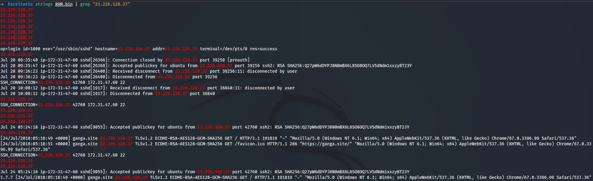
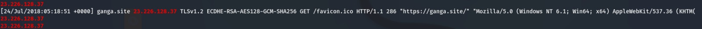
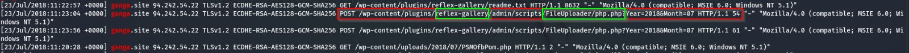
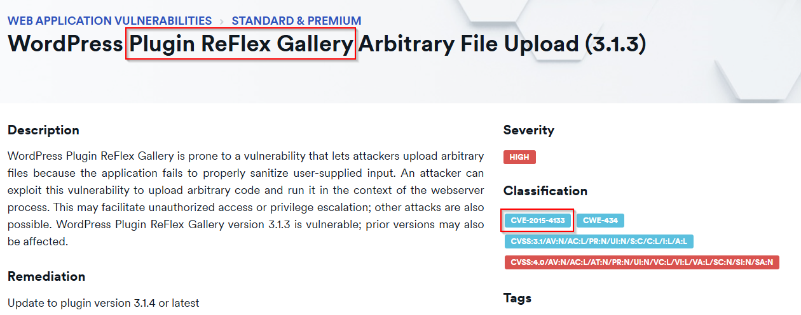
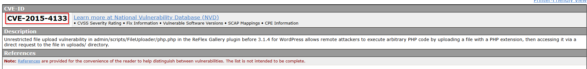

# Informe de investigación

 

**Trabajo realizado por:**

*Ángel Alberto Martínez Sánchez*

*Álvaro Caro Fernádez*

*Yeray Almoguera González*

*Rafael Tocino Batista*

*Gonzalo Pulido Sánchez*

 

## **Índice**

- [**Introducción**](#introduccion)
- [**Verificación de Hashes**](#verificacion-hashes)
- [**Análisis de la memoria**](#análisis-de-la-memoria)
    - [Detección de procesos sospechosos](#detección-de-procesos-sospechosos-linuxmalfind)
    - [Listado de procesos](#listado-de-procesos-linuxpslist)  
    - [Exploración de archivos](#exploración-de-archivos-linuxpagecachefiles)
    - [Configuración de red](#configuración-de-red-linuxsockstat)
    - [Búsqueda con strings](#búsqueda-con-strings)
- [**Conclusión**](#conclusión)

 

## **Introducción**

Este informe detalla los resultados obtenidos tras el análisis de una captura de memoria RAM. El objetivo inicial fue identificar el perfil necesario para utilizar la herramienta Volatility 3. Se documentarán los procedimientos realizados, las herramientas empleadas y los hallazgos más relevantes.

 

## **Verificación de hashes**

Se verificaron los hashes MD5 y SHA1 proporcionados para los archivos RAM.bin y Disc.E01, comparándolos con los generados mediante la aplicación `HashMyFiles`. Los resultados coinciden, demostrando la validez de los archivos:

| Archivos | Hash MD5 original | Hash SHA1 original | Hash MD5 verificado | Hash SHA1 verificado |
| :---- | :---- | :---- | :---- | :---- |
| RAM.bin | e063c257d2f41ddee65ea1fdabe64e95 | bc2ebb435e75b3406280a2967b1c2696fc3e160a | e063c257d2f41ddee65ea1fdabe64e95 | bc2ebb435e75b3406280a2967b1c2696fc3e160a |

 

## Análisis de la memoria

### **Detección de procesos sospechosos (linux.malfind)**

Se identificaron procesos potencialmente maliciosos con IDs `5573`, `6262` y `6266`.

---

### **Listado de procesos (linux.pslist)**

Mostró que los procesos sospechosos están vinculados al servidor web Apache. Además, muestra el proceso padre y la fecha y hora en la que fueron iniciados.

---

### **Exploración de archivos (linux.pagecache.Files)**

Se buscaron archivos relevantes (.rar, .png, .php, etc.) y logs relacionados con WordPress y Apache. Aunque algunos archivos fueron identificados, no se pudieron analizar completamente. En cambio, al hacer un grep con `WordPress` y con `\.log`, encontramos un `tar.gz`, donde nos indica la versión de WordPress instalada, además de archivos `.log` relacionados con Apache.

---

### **Configuración de red (linux.sockstat)**

Se identificó la IP asignada a la máquina: `172.31.47.60`; además de la IP de una conexión por SSH: `23.226.128.37`.

---

### **Búsqueda con strings**

El análisis con `strings` mostró un archivo sospechoso (`php.php`) dentro del plugin ReFlex Gallery, afectado por una vulnerabilidad conocida (CVE). Esta vulnerabilidad permite subir archivos maliciosos que podrían facilitar accesos no autorizados o escaladas de privilegios.

Con este strings encontramos que la IP de la conexión SSH, está relacionada con una página llamada `ganga.site`.

---
Al buscar con el comando Strings por la página obtenida, obtenemos también una IP, dándonos a indicar que esta sería la IP de la que provenía el ataque.

Encontramos un POST a un directorio de WordPress, concretamente a los plugins, donde vemos que hay un archivo `php.php` que parece haber sido subido mediante este plugin, lo que puede signifcar que es un plugin que permite la subida de archivos maliciosos a WordPress.

Este plugin se llama `reflex-gallery`, como podemos observar en la imagen anterior, si buscamos en cualquier navegador este plugin, podemos comprobar como se trata de una vulnerabilidad.

Además nos indica el CVE relacionado que si buscamos encontramos lo siguiente:

 

## **Conclusión**

El análisis forense permitió identificar una serie de procesos sospechosos vinculados al servidor Apache y una vulnerabilidad explotada en WordPress mediante el plugin ReFlex Gallery. Estos hallazgos deberán complementarse en el futuro con un análisis más profundo del disco duro para confirmar las actividades maliciosas detectadas.