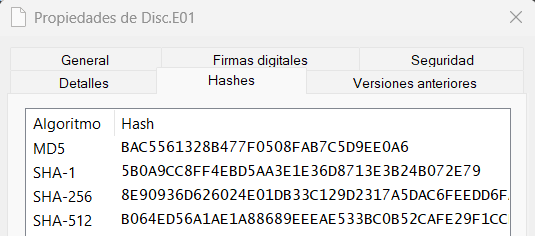
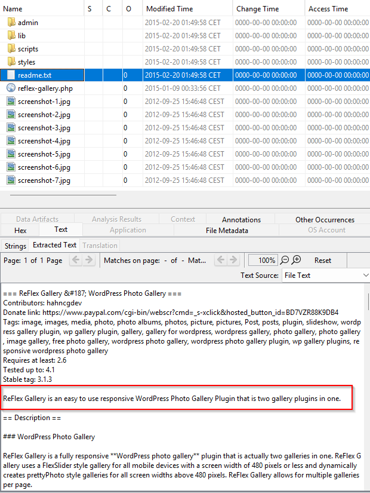
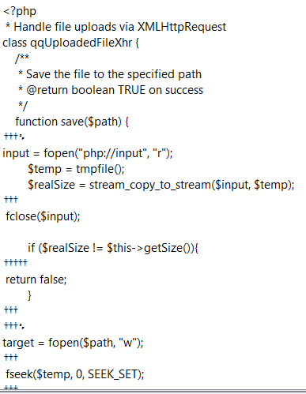
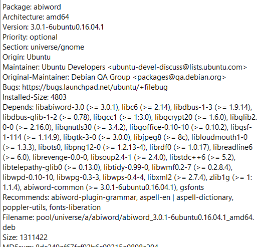
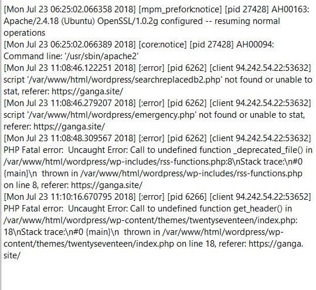
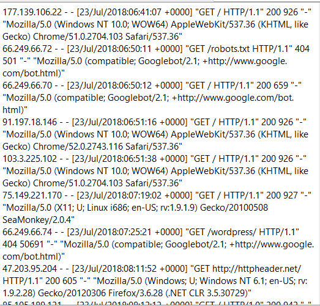

# **Memoria de Trabajo - Análisis Forense del Disco Duro**

## **Verificación de Integridad de Archivos**

Se realizó la verificación de los hashes MD5 y SHA1 correspondientes del archivo `Disc.E01`, utilizando la herramienta [`OpenHashTab`](https://github.com/namazso/OpenHashTab). Los valores generados coincidieron exactamente con los proporcionados originalmente, lo que confirma la integridad y autenticidad de los archivos analizados. Este paso inicial es crucial para garantizar que los datos no han sido alterados desde su adquisición.

| Archivo   | Hash MD5 Original                 | Hash SHA1 Original                                   | Hash MD5 Verificado              | Hash SHA1 Verificado                              |
|-----------|-----------------------------------|-----------------------------------------------------|-----------------------------------|--------------------------------------------------|
| Disc.E01  | BAC5561328B477F0508FAB7C5D9EE0A6 | 5B0A9CC8FF4EBD5AA3E1E36D8713E3B24B072E79           | BAC5561328B477F0508FAB7C5D9EE0A6 | 5B0A9CC8FF4EBD5AA3E1E36D8713E3B24B072E79         |



---

## **Análisis del Disco Duro**

### **Hallazgo 1: Vulnerabilidad en el Plugin ReFlex Gallery**

El análisis reveló que el servidor comprometido contenía el plugin ReFlex Gallery 3.1.3 para WordPress, conocido por su vulnerabilidad crítica (CVE-2015-4133). Esta vulnerabilidad permite la carga arbitraria de archivos a través del script `php.php`, ubicado en `/admin/scripts/FileUploader/`. El atacante explotó esta debilidad para cargar múltiples archivos maliciosos.

La evidencia directa proviene del código del archivo `php.php`, donde se observa que carece de validación en las extensiones permitidas (`$allowedExtensions` vacío). Además, permite configurar rutas arbitrarias mediante parámetros GET (`Year` y `Month`), lo que facilita la manipulación de directorios sensibles. 

En los registros de acceso (`access.log`), se identificaron múltiples solicitudes POST al script desde la IP `94.242.54.22`, cargando archivos como `PSMOfbPom.php` y `XLPYhlEtQOyiMKb.php`. Esto confirma el uso activo del plugin como vector de ataque.

| **Elemento** | **Detalle** |
| :---- | :---- |
| **Ruta de localización** |//home/ubuntu/reflex-gallery.3.1.3.zip |
| **Contenido del fichero**| | 
| **MAC Time**: 2015-02-20 01:49:58 CET | **Modificado**: 0000-00-00 00:00:00 **Accedido**: 0000-00-00 00:00:00 **Creado**: 0000-00-00 00:00:00|
| **Tamaño lógico del fichero** | 650.283 bytes |
| **Valor hash (SHA-256)** | e83d9cc433224247c1b1a6b18dd0d023b59d3864c530fc32a7c08f4b1addc57a |
| **Soporte de hallazgos** | Archivo contenido en un paquete ZIP que incluye versiones antiguas del plugin. |

---

### **Hallazgo 2: Script php.php como Punto de Entrada**

El archivo `php.php` fue identificado como el principal punto de entrada del ataque. Su diseño vulnerable permitió al atacante realizar cargas arbitrarias y ejecutar código malicioso en el servidor.

#### **Riesgos Detectados:**
1. **Inyección de Rutas:** Los parámetros GET (`Year` y `Month`) permiten manipular rutas críticas mediante técnicas como `../../`.
2. **Ejecución Remota:** Los archivos cargados se almacenan directamente en `/wp-content/uploads/`, habilitando su ejecución inmediata.
3. **Falta de Sanitización:** No se restringen las extensiones ni se valida el contenido de los archivos subidos.

En el registro `access.log`, se documentó que la IP atacante subió ocho archivos PHP en menos de 24 horas, incluyendo nombres como `PLoeJFOEVoc.php`. Esto demuestra un patrón sistemático para comprometer el sistema.

| **Elemento** | **Detalle** |
| :---- | :---- |
| **Ruta de localización** |//var/www/html/wordpress/wp-content/plugins/reflex-gallery/admin/scripts/FileUploader/php.php|
| **Contenido del fichero** |  || 
| **MAC Time** | **Modificado**: : 2018-07-20 11:54:05** CEST **Accedido**: 2018-07-23 13:20:26 CEST **Creado**: 2018-07-20 11:54:05 CEST |
| **Tamaño lógico del fichero** | 5764 bytes |
| **Valor hash (SHA-256)** | ED89FBB40C821B1BC844CBB3B86B946EECA5158C25B12D57290B69BF74C784A8 | 
| **Soporte de hallazgos** | Script PHP vulnerable que permitió la carga de archivos maliciosos. Punto clave del compromiso del sistema. |

---

### **Hallazgo 3: Archivo PLoeJFOEVoc.php**

Aunque este archivo no contiene código malicioso, fue subido mediante el script vulnerable `php.php`. Su contenido incluye una lista genérica de categorías (como "developers" o "finance"), lo que sugiere que fue utilizado como prueba inicial para confirmar la funcionalidad del script antes de cargar exploits reales.

**Detalles Técnicos:**
- **Ruta:** `/var/www/html/wordpress/wp-content/uploads/2018/07/PLoeJFOEVoc.php`
- **Tamaño:** 102 bytes
- **Contenido:** Lista genérica sin código ejecutable.
- **Hash SHA-256:** C99B7480EC4AA3E94957260B80471865B560308949A56A167B8CD327494C5AFE

Este archivo es inofensivo por sí mismo, pero forma parte integral del ataque al demostrar la explotación exitosa del script vulnerable.

| **Elemento** | **Detalle** |
| :---- | :---- |
| **Ruta de localización** | //var/www/html/wordpress/wp-content/uploads/2018/07/PLoeJFOEVoc.php |
| **Contenido del fichero** |  |
| **MAC Time** | **Modificado**: 2018-07-23 16:22:37 CEST **Accedido**: 2018-07-23 16:22:37 CEST **Creado**: 2018-07-23 16:22:37 CEST |
| **Tamaño lógico del fichero** | 102 bytes |
| **Valor hash (SHA-256)** | C99B7480EC4AA3E94957260B80471865B560308949A56A167B8CD327494C5AFE |
| **Soporte de hallazgos** | Subido mediante el script vulnerable `php.php`. Aunque no es directamente dañino, forma parte del ataque. |
| **Observaciones** | Archivo posiblemente subido como prueba para verificar la funcionalidad del script vulnerable. Debe ser eliminado. |

---

### **Hallazgo 4: Archivo XLPYhlEtQOyiMKb.php**

Este archivo contiene metadatos relacionados con paquetes y dependencias de software Ubuntu, como AbiWord. Aunque no presenta código malicioso, su presencia sugiere que el atacante intentó recopilar información del entorno o realizar pruebas relacionadas con la exfiltración de datos.

**Detalles Técnicos:**
- **Ruta:** `/var/www/html/wordpress/wp-content/uploads/2018/07/XLPYhlEtQOyiMKb.php`
- **Tamaño:** 4,257,532 bytes
- **Contenido:** Información sobre paquetes Ubuntu.
- **Hash SHA-256:** D0011835A90755E40EE51818D7C8103C759D791EA45CB5496970234981EA85D8

Este hallazgo refuerza la hipótesis de un ataque dirigido a explorar las capacidades del servidor comprometido.

| **Elemento** | **Detalle** |
| :---- | :---- |
| **Ruta de localización** | //var/www/html/wordpress/wp-content/uploads/2018/07/XLPYhlEtQOyiMKb.php |
| **Contenido del fichero** |  |
| **MAC Time** | **Modificado**: 2018-07-23 20:34:03 CEST **Accedido**: 2018-07-24 02:46:56 CEST **Creado**: 2018-07-24 02:46:55 CEST |
| **Tamaño lógico del fichero** | 4257532 bytes |
| **Valor hash (SHA-256)** | D0011835A90755E40EE51818D7C8103C759D791EA45CB5496970234981EA85D8 |
| **Soporte de hallazgos** | Subido mediante el script vulnerable `php.php`. Forma parte del ataque dirigido al servidor. |

---

### **Hallazgo 5: Registro error.log**

El archivo `error.log` documenta errores críticos relacionados con WordPress, incluyendo intentos fallidos de acceso a scripts inexistentes (como `searchreplacedb2.php`) y errores fatales en PHP debido a funciones no definidas (`_deprecated_file()`).

**Errores Clave Identificados:**
1. Intentos de acceder a scripts vulnerables no instalados:
   ```text
   script '/var/www/html/wordpress/searchreplacedb2.php' not found
   ```
2. Fallos en funciones PHP:
   ```text
   PHP Fatal error: Call to undefined function _deprecated_file()
   ```

Estos registros sugieren que el servidor ejecutaba una versión desactualizada o mal configurada de WordPress, lo cual facilitó aún más el ataque.

| **Elemento** | **Detalle** |
| :---- | :---- |
| **Ruta de localización** | //var/log/apache2/error.log |
| **Contenido del fichero** |  |
| **MAC Time** | **Modificado**: 2018-07-23 13:10:16 CEST **Accedido**: 2018-07-23 08:25:01 CEST **Creado**: 2018-07-23 08:25:01 CEST |
| **Tamaño lógico del fichero** | 1369 bytes |
| **Valor hash (SHA-256)** | A8F34244C110114462935045C11C9208F846B54ABE47EA69909EBBD46518EAEC |
| **Soporte de hallazgos** | Indica intentos de acceder a scripts vulnerables y errores en configuraciones de WordPress. Relacionado con la actividad desde la IP `94.242.54.22`. |

---

### **Hallazgo 6: Registro access.log**

El registro `access.log` proporciona evidencia detallada sobre las actividades del atacante desde la IP `94.242.54.22`. Este registro documenta:
1. Exploración inicial mediante WPScan:
   ```text
   "WPScan v2.9.5-dev (http://wpscan.org)"
   ```
   Se detectaron intentos de escanear rutas sensibles como `/wp-config.php` y `/database.sql`.
2. Subida y ejecución de archivos maliciosos:
   ```text
   POST /wp-content/plugins/reflex-gallery/admin/scripts/FileUploader/php.php?Year=2018&Month=07
   GET /wp-content/uploads/2018/07/PSMOfbPom.php
   ```

Estos patrones confirman un ataque bien estructurado basado en herramientas automatizadas y explotación manual.

| **Elemento** | **Detalle** |
| :---- | :---- |
| **Ruta de localización** | //var/log/apache2/access.log |
| **Contenido del fichero** |  |
| **MAC Time** | **Modificado**: 2018-07-24 07:19:11 CEST **Accedido**: 2018-07-23 08:25:01 CEST **Creado**: 2018-07-24 07:19:11 CEST |
| **Tamaño lógico del fichero** | 111514 bytes |
| **Valor hash (SHA-256)** | 46BF61392DE369143890AE080E91502050F9478CD3D1DCB063C8223A6E58662E |
