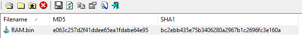
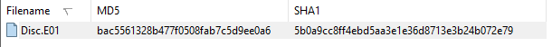
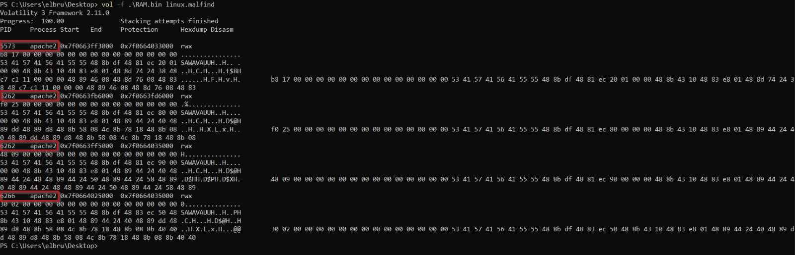
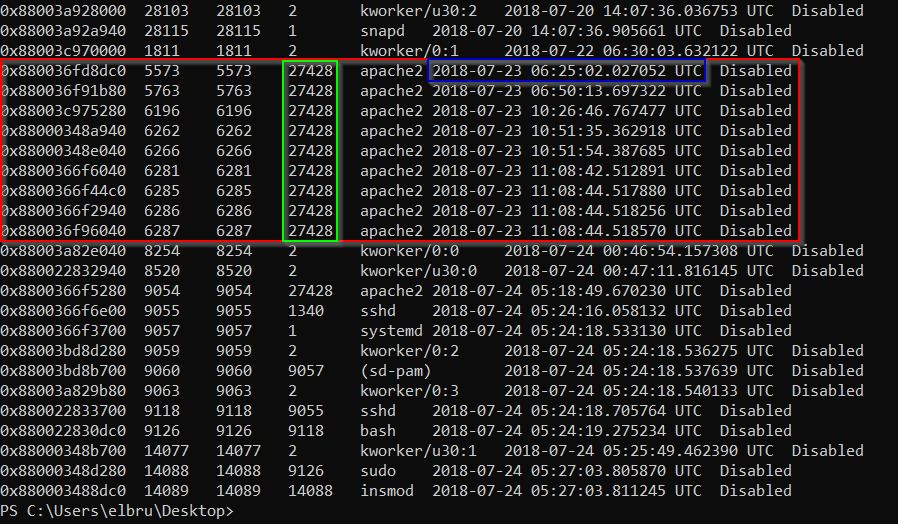
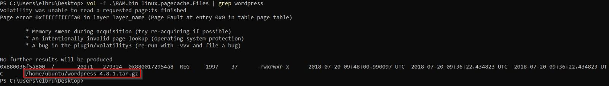
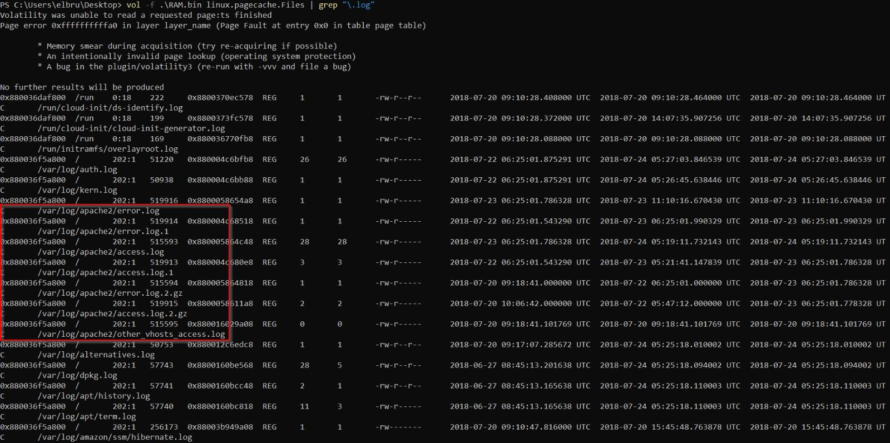
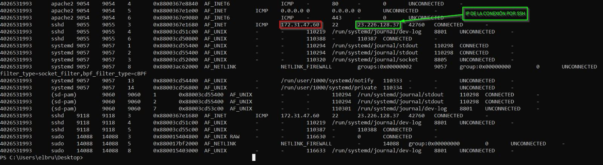
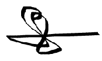

# Informe Defacement Attack

**Nombre:** Defacement Attack

**Equipo forense:** Grupo 1

**Fecha:** 13/04/2025

 

## Índice

- [Palabras claves](#palabras-claves)
- [Resumen ejecutivo](#resumen-ejecutivo)
- [Introducción](#introducción)
    - [Datos del equipo](#datos-del-equipo)
    - [Antecedentes](#antecedentes)
    - [Alcance](#alcance)
    - [Objetivos](#objetivos)
- [Fuentes de información](#fuentes-de-información)
    - [Verificación de integridad](#verificación-de-integridad)
- [Análisis](#análisis)
    - [Entorno de trabajo y herramientas utilizadas](#entorno-de-trabajo-y-herramientas-utilizadas)
- [Procesos](#procesos)
    - [Línea del tiempo](#línea-del-tiempo)
- [Limitaciones del análisis](#limitaciones-del-análisis)
- [Conclusiones](#conclusiones)
- [Anexos](#anexos)
  - [Anexo 1. Hallazgos](#anexo-1-hallazgos)
  - [Anexo 2. Cadena de custodia](#anexo-2-cadena-de-custodia)
  - [Anexo 3. Metodología](#anexo-3-metodología)
  - [Anexo 4. Declaración juramento y tacha](#anexo-4-declaración-juramento-y-tacha)

 

## Palabras claves

- **Defacement:** Alteración no autorizada del contenido legítimo de una página web.
- **MAC Time:** Información sobre modificación, acceso y creación de archivos.
- **Hash:** Código único que garantiza la integridad de un archivo.
- **Cadena de custodia:** Proceso que asegura la preservación y trazabilidad de los hallazgos digitales.

 

## Resumen ejecutivo

Este informe presenta los hallazgos obtenidos tras la investigación forense de un incidente de seguridad en la página web de una empresa, la cual fue objeto de un ataque tipo defacement. El análisis se centró en el sistema afectado, evaluando el contenido de la memoria RAM y el disco del servidor para identificar las causas del ataque y los elementos involucrados. Los resultados se describen de forma técnica y objetiva, sin emitir juicios ni conclusiones subjetivas.

 

## Introducción

### Datos del equipo

El presente informe ha sido elaborado por el Grupo 1, compuesto por profesionales con experiencia en ciberseguridad aplicada a entornos tecnológicos. A continuación, se detalla la lista de especialistas que integran este equipo técnico.

- Ángel Alberto Martínez Sánchez, amarsan702@g.educaand.es
- Yeray Almoguera González, yalmgon271@g.educaand.es
- Álvaro Caro Fernández, acarfer452@g.educaand.es
- Gonzalo Pulido Sánchez, gpulsan0702@g.educaand.es
- Rafael Tocino Batista, rtocbat936@g.educaand.es

---

### Antecedentes

La empresa sufrió un ataque tipo defacement, lo que implica una manipulación no autorizada del contenido legítimo de su página web. Este tipo de ataque puede ser indicativo de vulnerabilidades en el sistema o explotación por parte de actores maliciosos.

---

### Alcance

El análisis se limitó a las fuentes proporcionadas por el administrador del servidor afectado: una captura de memoria RAM y una imagen del disco duro. Estas fuentes fueron examinadas para identificar procesos sospechosos, archivos modificados y cualquier otro elemento técnico relacionado con el incidente. El objetivo del alcance fue garantizar una evaluación precisa y técnica dentro de las limitaciones impuestas por los hallazgos disponibles.

---

### Objetivos

El objetivo principal fue identificar los elementos técnicos relacionados con el ataque, lo que permitió comprender en profundidad cómo se llevó a cabo. A partir de este análisis, se determinaron tanto las causas del incidente como su impacto en el sistema afectado. Finalmente, se elaboraron recomendaciones específicas orientadas a prevenir la repetición de este tipo de ataques en el futuro.

 

## Fuentes de información

### Verificación de integridad

| Archivos | Hash MD5 original | Hash SHA1 original | Hash MD5 verificado | Hash SHA1 verificado |
| :---- | :---- | :---- | :---- | :---- |
| RAM.bin | e063c257d2f41ddee65ea1fdabe64e95 | bc2ebb435e75b3406280a2967b1c2696fc3e160a | e063c257d2f41ddee65ea1fdabe64e95 | bc2ebb435e75b3406280a2967b1c2696fc3e160a |

| Archivo   | Hash MD5 Original                 | Hash SHA1 Original                                   | Hash MD5 Verificado              | Hash SHA1 Verificado                              |
|-----------|-----------------------------------|-----------------------------------------------------|-----------------------------------|--------------------------------------------------|
| Disc.E01  | BAC5561328B477F0508FAB7C5D9EE0A6 | 5B0A9CC8FF4EBD5AA3E1E36D8713E3B24B072E79| BAC5561328B477F0508FAB7C5D9EE0A6| 5B0A9CC8FF4EBD5AA3E1E36D8713E3B24B072E79|

 

## Análisis

### Entorno de trabajo y herramientas utilizadas

El análisis forense se realizó en un entorno aislado y controlado para garantizar la integridad de los hallazgos. Se emplearon las siguientes herramientas:

| Herramienta              | Descripción                                                                                                                                                                                                                     |
|--------------------------|-----------------------------------------------------------------------------------------------------------------------------------------------------------------------------------------|
| Volatility 3 Framework   | Se utiliza para el análisis de la memoria RAM, permitiendo examinar los procesos en ejecución y otros artefactos presentes en la memoria para identificar actividades sospechosas.                                            |
| FTK Imager (7.5)         | Utilizada para la creación de imágenes forenses de discos duros y otros dispositivos de almacenamiento, garantizando la integridad de los datos originales durante la adquisición.                                            |
| Herramientas de hash     | Se utilizan para verificar la integridad de las imágenes de memoria y disco, asegurando que no han sido alteradas desde su adquisición.                                                                                       |
| **OpenHashTab**          | Extensión para Windows que permite calcular y verificar hashes directamente desde las propiedades de archivo. Soporta 28 algoritmos, integración con VirusTotal y exportación de resultados al portapapeles o archivo.       |
| **HashMyFiles**          | Utilidad portátil que calcula hashes MD5, SHA1 y CRC32 para uno o más archivos. Permite copiar los resultados al portapapeles o exportarlos a formatos como texto, HTML o XML.                                               |
| **strings**              | Herramienta de línea de comandos en Linux que extrae cadenas de texto legibles (ASCII o Unicode) de archivos binarios. Es útil en análisis forense para identificar información oculta en ejecutables, registros o bibliotecas compartidas. |
| Autopsy (4.21.0)         | Se emplea para el análisis de la imagen del disco duro, facilitando la recuperación y el examen de archivos modificados, así como la reconstrucción de la actividad del sistema en el tiempo.                                  |

 

## Procesos

### Identificación de la vulnerabilidad
Durante el análisis del servidor comprometido, se detectó la presencia del plugin ReFlex Gallery 3.1.3 para WordPress, conocido por su vulnerabilidad crítica (CVE-2015-4133). Esta vulnerabilidad permite la carga arbitraria de archivos a través del script php.php ubicado en la ruta `/admin/scripts/FileUploader/`. El atacante explotó esta debilidad para cargar múltiples archivos maliciosos, aprovechando que el código del archivo php.php carece de validación en las extensiones permitidas y permite configurar rutas arbitrarias mediante parámetros GET como `Year` y `Month`. Los registros de acceso (access.log) confirmaron solicitudes POST sospechosas desde la IP 94.242.54.22, asociadas a la carga de archivos como PSMOfbPom.php y XLPYhlEtQOyiMKb.php.

### Determinación del punto de entrada del ataque
El script php.php fue identificado como el principal vector de ataque. Su diseño vulnerable permitió al atacante realizar cargas arbitrarias y ejecutar código malicioso en el servidor. Se documentaron riesgos específicos:

- **Inyección de rutas**: Los parámetros GET permiten manipular rutas críticas mediante técnicas como `../../`.  
- **Ejecución remota**: Los archivos cargados se almacenan directamente en `/wp-content/uploads/`, habilitando su ejecución inmediata.  
- **Falta de sanitización**: No se restringen las extensiones ni se valida el contenido de los archivos subidos.

Los registros muestran que la IP atacante subió ocho archivos PHP en menos de 24 horas.

### Descubrimiento de los archivos maliciosos
Se identificaron dos archivos relevantes:

1. **PLoeJFOEVoc.php**: Aunque no contiene código malicioso, fue utilizado como prueba inicial para confirmar la funcionalidad del script php.php antes de cargar exploits reales. Su contenido incluye una lista genérica de categorías.  
     
   - Ruta: `/var/www/html/wordpress/wp-content/uploads/2018/07/PLoeJFOEVoc.php`  
   - Tamaño: 102 bytes  
   - Hash SHA-256: C99B7480EC4AA3E94957260B80471865B560308949A56A167B8CD327494C5AFE

2. **XLPYhlEtQOyiMKb.php**: Contiene metadatos relacionados con paquetes y dependencias de software Ubuntu, como AbiWord. Su presencia sugiere intentos del atacante por recopilar información del entorno o realizar pruebas relacionadas con la exfiltración.  
     
   - Ruta: `/var/www/html/wordpress/wp-content/uploads/2018/07/XLPYhlEtQOyiMKb.php`  
   - Tamaño: 4,257,532 bytes  
   - Hash SHA-256: D0011835A90755E40EE51818D7C8103C759D791EA45CB5496970234981EA85D8

### Análisis de los registros
Se analizaron dos registros principales:

1. **error.log**: Documenta errores críticos relacionados con WordPress, incluyendo intentos fallidos de acceso a scripts inexistentes (como searchreplacedb2.php) y errores fatales en PHP debido a funciones no definidas (\_deprecated\_file()). Estos errores indican que el servidor ejecutaba una versión desactualizada o mal configurada de WordPress.  
2. **access.log**: Proporciona información detallada sobre las actividades del atacante desde la IP 94.242.54.22, incluyendo exploración inicial mediante WPScan y subida y ejecución de archivos maliciosos.

### Línea del tiempo

## Limitaciones del análisis
No se identificaron limitaciones significativas durante el proceso de investigación. Sin embargo, se presentaron ciertas complicaciones relacionadas con el análisis de la memoria del sistema. En particular, los comandos necesarios para llevar a cabo esta tarea diferían de los conocidos previamente por el equipo, lo que requirió tiempo adicional para investigar y adaptar las herramientas y procedimientos utilizados. Este desafío fue superado mediante la consulta de documentación técnica y la implementación de soluciones adecuadas para garantizar la correcta extracción y análisis de los datos de memoria.

 

## Conclusiones

Tras un análisis exhaustivo del incidente, se concluye que fue posible identificar con éxito los elementos técnicos vinculados al ataque. Esto incluyó tanto los vectores empleados por el atacante como los archivos maliciosos que fueron cargados en el servidor. Además, se logró determinar con precisión la causa principal del incidente, la cual se originó en una vulnerabilidad del plugin ReFlex Gallery, así como el impacto que este ataque generó sobre el sistema afectado.

Los objetivos establecidos al inicio del proyecto se cumplieron plenamente. Gracias a ello, se pudo reconstruir de manera detallada la cronología del ataque y se obtuvo una visión clara y completa de los hallazgos técnicos más relevantes.

En definitiva, este informe muestra que se llevó a cabo un análisis forense integral, capaz de responder con solidez a las preguntas formuladas por la gerencia en relación con el incidente investigado. En base a los hallazgos presentados, se recomienda actualizar el plugin ReFlex Gallery a una versión parcheada o considerar su reemplazo, implementar un sistema de detección de intrusiones (IDS) para monitorear actividades anómalas, y realizar auditorías de seguridad periódicas. Este incidente subraya la importancia de un enfoque proactivo en la seguridad, incluyendo la actualización regular de software y la capacitación del personal, para minimizar el riesgo de incidentes futuros.

## Anexos
## Anexo 1. Hallazgos
## Análisis de disco duro  
### Hallazgo 1
| Ruta de localización | //home/ubuntu/reflex-gallery.3.1.3.zip |
| :---- | :---- |
| **Contenido del fichero** |  |
| **MAC Time** | **Modificado**: 2015-02-20 01:49:58 CET **Accedido**: 2015-02-20 01:49:58 CET **Creado**: 2015-02-20 01:49:58 CET |
| **Tamaño lógico del fichero** | 650.283 bytes |
| **Valor hash (SHA-256)** | e83d9cc433224247c1b1a6b18dd0d023b59d3864c530fc32a7c08f4b1addc57a |

### Hallazgo 2
| Ruta de localización | //var/www/html/wordpress/wp-content/plugins/reflex-gallery/admin/scripts/FileUploader/php.php |
| :---- | :---- |
| **Contenido del fichero** |  |
| **MAC Time** | **Modificado**: : 2018-07-20 11:54:05** CEST **Accedido**: 2018-07-23 13:20:26 CEST **Creado**: 2018-07-20 11:54:05 CEST |
| **Tamaño lógico del fichero** | 5764 bytes |
| **Valor hash (SHA-256)** | ED89FBB40C821B1BC844CBB3B86B946EECA5158C25B12D57290B69BF74C784A8 |

### Hallazgo 3
| Ruta de localización | //var/www/html/wordpress/wp-content/uploads/2018/07/PLoeJFOEVoc.php |
| :---- | :---- |
| **Contenido del fichero** |  |
| **MAC Time** | **Modificado**: 2018-07-23 16:22:37 CEST **Accedido**: 2018-07-23 16:22:37 CEST **Creado**: 2018-07-23 16:22:37 CEST |
| **Tamaño lógico del fichero** | 102 bytes |
| **Valor hash (SHA-256)** | C99B7480EC4AA3E94957260B80471865B560308949A56A167B8CD327494C5AFE |

### Hallazgo 4
| Ruta de localización | //var/www/html/wordpress/wp-content/uploads/2018/07/XLPYhlEtQOyiMKb.php |
| :---- | :---- |
| **Contenido del fichero** |  |
| **MAC Time** | **Modificado**: 2018-07-23 20:34:03 CEST **Accedido**: 2018-07-24 02:46:56 CEST **Creado**: 2018-07-24 02:46:55 CEST |
| **Tamaño lógico del fichero** | 4257532 bytes |
| **Valor hash (SHA-256)** | D0011835A90755E40EE51818D7C8103C759D791EA45CB5496970234981EA85D8 |

### Hallazgo 5
| Ruta de localización | //var/log/apache2/error.log |
| :---- | :---- |
| **Contenido del fichero** |  |
| **MAC Time** | **Modificado**: 2018-07-23 13:10:16 CEST **Accedido**: 2018-07-23 08:25:01 CEST **Creado**: 2018-07-23 08:25:01 CEST |
| **Tamaño lógico del fichero** | 1369 bytes |
| **Valor hash (SHA-256)** | A8F34244C110114462935045C11C9208F846B54ABE47EA69909EBBD46518EAEC |

### Hallazgo 6
| **Ruta de localización** | //var/log/apache2/access.log |
| :---- | :---- |
| **Contenido del fichero** |  |
| **MAC Time** | **Modificado**: 2018-07-24 07:19:11 CEST **Accedido**: 2018-07-23 08:25:01 CEST **Creado**: 2018-07-24 07:19:11 CEST |
| **Tamaño lógico del fichero** | 111514 bytes |
| **Valor hash (SHA-256)** | 46BF61392DE369143890AE080E91502050F9478CD3D1DCB063C8223A6E58662E |

## Análisis de la memoria  
### Hallazgo 1
| Comando utilizado | `linux.malfind` |
| :---- | :---- |
| **Contenido del fichero** |  |

### Hallazgo 2

| Comando utilizado | `linux.pslist` |
| :---- | :---- |
| **Contenido del fichero** |  |

### Hallazgo 3

| Comando utilizado | `linux.pagecache.Files` |
| :---- | :---- |
| **Contenido del fichero** |   |

### Hallazgo 4

| Comando utilizado | `linux.sockstat` |
| :---- | :---- |
| **Contenido del fichero** |  |

## Anexo 2. Cadena de custodia
| Sección | Campo |
| :---- | :---- |
| **1. INFORMACIÓN DEL CASO** |  |
| Número de Caso | 05.2 |
| Tipo de Investigación | Análisis forense |
| Fecha de Adquisición | 27/03/2025 |
| Lugar de Adquisición | C/Pericón de Cádiz ,s/n–11002,Cádiz(Cádiz) |
| **2. DESCRIPCIÓN DEL HALLAZGO EN ORIGINAL** |  |
| **Tipo de Dispositivo** | **Captura de Memoria (RAM.bin)** |
| Hash del Hallazgo Original (MD5) | e063c257d2f41ddee65ea1fdabe64e95 |
| Hash del Hallazgo Original (SHA1) | bc2ebb435e75b3406280a2967b1c2696fc3e160a |
| **Tipo de Dispositivo** | **Imagen de disco (Disc.E01)** |
| Hash del Hallazgo Original (MD5) | bac5561328b477f0508fab7c5d9ee0a6 |
| Hash del Hallazgo Original (SHA256) | 5b0a9cc8ff4ebd5aa3e1e36d8713e3b24b072e79 |
| **3. PRESERVACIÓN DEL HALLAZGO ORIGINAL** |  |
| Fecha de Entrega | 22/03/2025 |
| Hora de Entrega | 08:00 |
| Recibido por | Manuel Jesús Rivas Sández |
| **4. CREACIÓN Y VERIFICACIÓN DE COPIAS** |  |
| Fecha y Hora de Creación | 08/04/2025, 20:00 |
| Técnico Responsable | Rafael Tocino  |
| Verificación de Integridad | Sí |
| Entregado a | Manuel Rivas Sández |
| Fecha y Hora de Entrega | 12/04/2025, 19:15 |
| **5. REGISTRO DE ACCESOS Y VERIFICACIONES** |  |
| Fecha y Hora | 08/04/2025, 20:45 |
| Propósito | Análisis de hallazgos |
| Técnico | Yeray Almoguera |
| Verificación de Integridad | Sí |

 

## Anexo 3. Metodología
La metodología empleada para la investigación de este incidente se basó en un enfoque forense digital estructurado, siguiendo las mejores prácticas reconocidas en la industria. El proceso se dividió en las siguientes etapas:

### Identificación y recolección

- **Identificación de activos**: Se identificaron los activos críticos dentro del alcance definido, incluyendo el servidor WordPress comprometido, los archivos de configuración, los registros de acceso y error, y los archivos maliciosos cargados (`PLoeJFOEVoc.php`, `XLPYhlEtQOyiMKb.php`, entre otros).  
- **Recolección de hallazgos**: Se realizó la adquisición forense de datos relevantes, incluyendo la captura de registros críticos (`access.log` y `error.log`). La integridad de las imágenes se verificó mediante la generación y comparación de hashes MD5 y SHA1.

### Preservación y análisis

- **Preservación del hallazgo**: Se garantizó la integridad de los hallazgos mediante herramientas especializadas y la documentación detallada de todos los procedimientos realizados.  
- **Análisis de logs**: Se analizaron los registros `access.log` y `error.log` para identificar patrones anómalos, solicitudes maliciosas al script vulnerable `php.php` y actividades relacionadas con la IP atacante (`94.242.54.22`).  
- **Análisis del código**: Se realizó un análisis estático del archivo vulnerable `php.php`, confirmando su falta de validación en extensiones permitidas y su capacidad para manipular rutas arbitrarias mediante parámetros GET.  
- **Análisis de archivos**: Se examinaron los archivos maliciosos cargados (`PLoeJFOEVoc.php`, `XLPYhlEtQOyiMKb.php`) para determinar su contenido, propósito y relación con el ataque.  
- **Análisis de metadatos**: Los metadatos de los archivos comprometidos fueron analizados para establecer fechas clave (creación, modificación y acceso), lo que permitió reconstruir una línea temporal precisa del incidente.

### Interpretación y atribución

- **Reconstrucción del incidente**: Se reconstruyó la secuencia completa del ataque, desde la explotación inicial del plugin vulnerable ReFlex Gallery hasta la carga y ejecución de archivos maliciosos.  
- **Atribución del atacante**: La dirección IP atacante (`94.242.54.22`) fue identificada como origen de múltiples solicitudes maliciosas. Además, se recopiló información sobre las herramientas utilizadas por el atacante, como WPScan.  
- **Evaluación del impacto**: Se evaluó el impacto del incidente, concluyendo que el atacante utilizó el servidor comprometido para cargar archivos potencialmente maliciosos y explorar información sensible del entorno.

### Documentación y reporte

- **Documentación detallada**: Todos los pasos realizados durante la investigación fueron documentados, incluyendo las herramientas utilizadas (como OpenHashTab para verificación de hashes), comandos ejecutados y hallazgos obtenidos.  
- **Elaboración del informe**: Se elaboró este informe técnico con un análisis detallado, conclusiones claras y recomendaciones específicas para mitigar las vulnerabilidades detectadas.

 

## Anexo 4. Declaración juramento y tacha
### Juramento  
Nosotros, el equipo de investigación, declaramos bajo juramento que el presente informe de análisis forense ha sido elaborado con total imparcialidad, profesionalismo y rigor técnico. Todas las actividades realizadas durante la investigación se llevaron a cabo respetando los principios éticos y legales aplicables.

Certificamos que los hallazgos, análisis y conclusiones incluidas en este informe reflejan fielmente los resultados obtenidos durante la evaluación del incidente de seguridad, sin omitir ni alterar información relevante para la interpretación de los mismos.

### Tacha  
En cumplimiento de las mejores prácticas y estándares de la industria, declaramos que no existe conflicto de interés alguno que pueda comprometer la objetividad del presente informe. Asimismo:

* No tenemos relación personal ni profesional con las partes involucradas en el incidente fuera del alcance de este proyecto.  
* No hemos recibido incentivos externos que puedan influir en la elaboración o los resultados del informe.  
* Nos comprometemos a mantener la confidencialidad de toda la información manejada durante la investigación, conforme a los acuerdos de confidencialidad establecidos.

Firmado electrónicamente por:

Fecha: 13 de abril de 2025
