# Informe Murder Investigation

**Nombre:** Murder Investigation

**Equipo forense:** Grupo 1

**Fecha:** 15/05/2025

<br>

## Índice

- [Palabras claves](#palabras-claves)
- [Resumen ejecutivo](#resumen-ejecutivo)
- [Introducción](#introducción)
    - [Datos del equipo](#datos-del-equipo)
    - [Antecedentes](#antecedentes)
    - [Alcance](#alcance)
    - [Objetivos](#objetivos)
- [Fuentes de información](#fuentes-de-información)
    - [Verificación de integridad](#verificación-de-integridad)
- [Análisis](#análisis)
    - [Entorno de trabajo y herramientas utilizadas](#entorno-de-trabajo-y-herramientas-utilizadas)
- [Procesos](#procesos)
    - [Línea del tiempo](#línea-del-tiempo)
- [Limitaciones del análisis](#limitaciones-del-análisis)
- [Conclusiones](#conclusiones)
- [Anexos](#anexos)
  - [Anexo 1. Hallazgos](#anexo-1-hallazgos)
  - [Anexo 2. Cadena de custodia](#anexo-2-cadena-de-custodia)
  - [Anexo 3. Metodología](#anexo-3-metodología)
  - [Anexo 4. Declaración juramento y tacha](#anexo-4-declaración-juramento-y-tacha)

<br>

## Palabras claves

- **IoT (Internet of Things / Internet de las Cosas)**  
  Objetos cotidianos conectados a internet, como sensores, cámaras, luces, etc.

- **Amazon Echo / Alexa**  
  Altavoz inteligente controlado por voz, capaz de ejecutar órdenes y responder preguntas.

- **Hub SmartThings**  
  Dispositivo central que conecta y controla otros aparatos inteligentes en una casa.

- **Router Google OnHub**  
  Aparato que proporciona conexión a Internet y gestiona la red en casa.

- **Raspberry Pi**  
  Pequeño ordenador de bajo coste.

- **Verificación de integridad / Algoritmo hash (SHA-256, MD5, SHA-1)**  
  Métodos matemáticos para comprobar que un archivo no ha cambiado usando códigos únicos llamados “hash”.

- **JSON**  
  Formato de archivo para intercambiar datos entre sistemas informáticos.

- **WAV**  
  Formato de archivo de audio digital.

- **Logs / registros de actividad**  
  Archivos que almacenan información sobre las acciones que se realizan en un dispositivo.

- **MAC Time**  
  Fechas y horas de modificación, acceso y creación de archivos.

- **Asistente virtual**  
  Programa que responde a comandos de voz y realiza tareas automáticamente.

- **Logs de sensores**  
  Registros automáticos de la actividad detectada por sensores (por ejemplo, movimiento o apertura de puertas).


<br>

## Resumen ejecutivo

Este informe documenta la investigación forense digital llevada a cabo en relación con el asesinato de una mujer ocurrido el 17 de julio de 2017 en su vivienda. Se analizaron múltiples dispositivos móviles e IoT presentes en la escena del crimen, con el objetivo de recolectar hallazgos digitales que ayude a esclarecer los hechos.

La investigación incluyó el análisis de una pulsera inteligente, teléfonos móviles, sensores de movimiento y puerta, un dispositivo Amazon Echo, un hub SmartThings, un router Google OnHub, una Raspberry Pi y otros equipos. El análisis permitió reconstruir una línea temporal aproximada de los eventos, identificar anomalías de comportamiento y extraer metadatos clave.

<br>

## Introducción

### Datos del equipo

El presente informe ha sido elaborado por el Grupo 1, compuesto por peritos con experiencia en ciberseguridad aplicada a entornos tecnológicos. A continuación, se detalla la lista de especialistas que integran este equipo técnico.

- Ángel Alberto Martínez Sánchez, amarsan702@g.educaand.es
- Yeray Almoguera González, yalmgon271@g.educaand.es
- Álvaro Caro Fernández, acarfer452@g.educaand.es
- Gonzalo Pulido Sánchez, gpulsan0702@g.educaand.es
- Rafael Tocino Batista, rtocbat936@g.educaand.es

---

### Antecedentes

El 17 de julio de 2017, a las 15:31, un conserje realizó una llamada al servicio de emergencias. Este afirmó que uno de los vecinos le había informado que su mujer había sido atacada en su hogar. La policía llegó al lugar a las 15:40 y encontró al conserje y al marido de la víctima en la escena del crimen. El marido alegó no haber escuchado nada debido al uso de auriculares. Se recolectaron varios dispositivos IoT y móviles como hallazgos.

---

### Alcance

Este informe se centra en el análisis forense digital de los dispositivos móviles e IoT recuperados en la escena del crimen, con el objetivo de extraer información útil para aclarar los hechos. Se incluye la correlación de eventos digitales con los testimonios recopilados y la reconstrucción de una línea temporal. Quedan excluidos del análisis los aspectos no digitales, como hallazgo físico o evaluaciones psicológicas.

---

### Objetivos

Este informe tiene como propósito analizar los hallazgos digitales recopilados en la escena del crimen para apoyar la investigación. Se busca identificar eventos clave, preservar la integridad de los datos y presentar los hallazgos de forma clara y comprensible. En particular, se pretende:

- Extraer y preservar información relevante de dispositivos móviles e IoT.

- Establecer una línea temporal de los hechos basada en registros digitales.

- Contrastar los testimonios con los hallazgos técnicos disponibles.

<br>

## Fuentes de información

### Verificación de integridad

| **Archivo** | **SHA-256** | **MD5** |
| -------------------------------- | ---------------------------------------------------------------- | -------------------------------- |
| InformeDiagnosticoOnHub | 4767513d714698afcd7506dd2304528a8db8243e2dff1be6e1ede591d0d19f83 | 4a07bd78d8f4ba227841c971eeb7d1b3 |
| Tráfico_SmartHome_PorCOAP.pcap | f5ad42a50ca0d16261c1ca4742d78fd99c9e7fc6ab67fdb3a53909ff7f786ce0 | 67ab09760148a66402aa7d9b0abaa322 |
| Trafico_SmartHome_PorIP.pcap   | a4664f1719d26382edd6d352cc8715fea3ee73bbb00245d71943fbacbbeeca3e | 8fb0edb521c9ad191adf55054203a6f4 |
| Alexa.zip | 6c09813eea5475dc0011c547e7fb774cfbd7216cafdeeb9a8308306046c14edf | 93639c62f68c5155611bbd7e8eb3f477 |
| smartphone_victima.zip | c3e334c996b811c51067e9e0657cb621523576f15eb2c19ec52c32bf36e3e5ff | 8daf9d23e39675452f99c5099a72b317 |
| smartphone_marido_victima.zip | 5a46acdf7fb5a70734a2e0e39a8c9b5cc9b7ee799fe800a0a7512af08e15c025 | 1472be511173e7e0f4919958b1c96ffe |
| TV_Inteligente.zip | 5423ea3f60d4ad0874346d3ba31c8783e5f2ce4b15b261ba0085e07f11e650e6 | d9d2b3b3048a836289cec02c6353b6e9 |

**Google OnHub:**

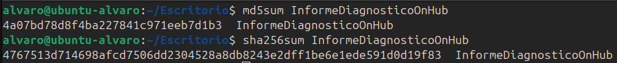

**Tráfico SmartHome Por COAP:**

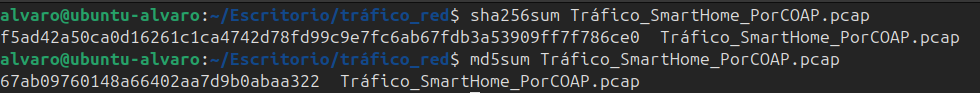

**Tráfico SmartHome Por IP:**

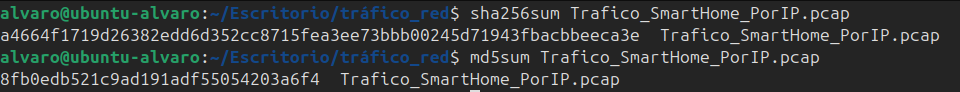

**Alexa:**


**Smartphone de la víctima:**

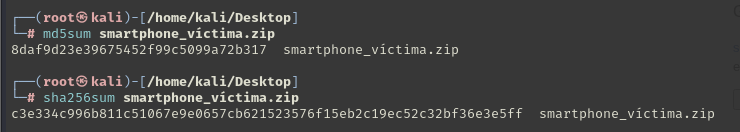

**Smartphone marido de la víctima:**

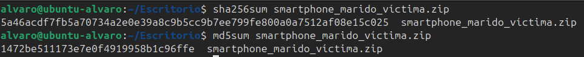

**TV Inteligente:**

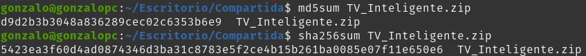


<br>

## Análisis

### Entorno de trabajo y herramientas utilizadas

El análisis forense se realizó en un entorno aislado y controlado para garantizar la integridad de los hallazgos. Se emplearon las siguientes herramientas:

| Herramienta    | Versión   |
|----------------|-----------|
| Autopsy        | 4.21.0    |
| FTK Imager     | 4.2.0     |
| Wireshark      | 4.4.6     |
| WhoisFreaks    | [Web](https://whoisfreaks.com/)       |
| NetworkMiner   | 3.0       |

<br>


## Procesos

El análisis forense siguió un protocolo estructurado para garantizar la correcta recolección, preservación y análisis de los hallazgos digitales. Cada etapa fue documentada para mantener la trazabilidad y facilitar la interpretación de los resultados.

### Análisis móvil victima

Para extraer hallazgos clave realizamos un examen exhaustivo del volcado de memoria, identificando primero los parámetros técnicos fundamentales. El dispositivo es un **Samsung Galaxy Note II LTE (modelo SHV-E250L)** con sistema operativo **Android 4.4.2 (KitKat)**, identificado internamente como `t0ltelgt`. La compilación del sistema data del **24 de agosto de 2015, 16:27:41 KST**.


Encontramos una **configuración regional contradictoria**: aunque la región está establecida como Reino Unido (`en-GB`) y el idioma principal es inglés, la zona horaria activa es **Asia/Seúl (KST)**. El sistema de seguridad Knox aparece activado, indicando posible uso empresarial o medidas de protección reforzadas.

---

#### Conexiones y Dispositivos Vinculados  
El análisis de las conexiones inalámbricas reveló **3 redes Wi-Fi memorizadas**:  
- `DFIRE` (red pública/coreana)  
- `HOME` (red doméstica principal)  
- `home` (posible red secundaria)  

En el apartado Bluetooth descubrimos **3 dispositivos emparejados** mediante el archivo `bt_config.xml`:  

1. **Altavoz inteligente Alexa**  
   - Nombre: `Echo-2W5`
   - MAC: `74:c2:46:88:5d:09`

    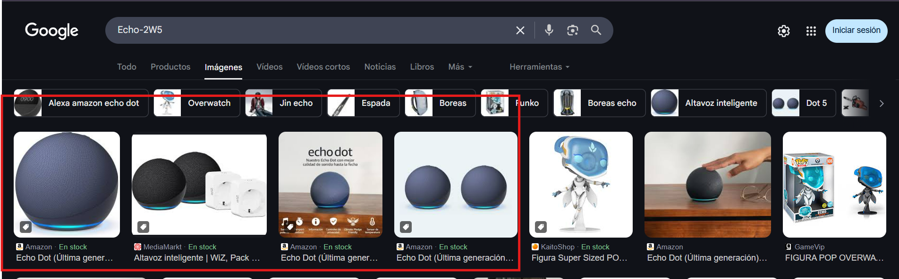

2. **Teléfono del esposo**
   - Nombre: `Simon (SHV-E250S)`
   - MAC: `50:f5:20:a5:7d:cc`
   - Mismo fabricante y generación que el dispositivo analizado  

3. **Pulsera inteligente no identificada**  
   - Nombre: `MI1A`  
   - MAC: `88:0f:10:f6:c8:b7`  

    


La revisión de la base de datos de correo electrónico (`EmailProvider.db`) mostró **mensajes rutinarios** tras la traducción del coreano:  
```plaintext
"Te llamaré más tarde."
"Vamos a almorzar juntos." 
"Avísame más tarde."
```
No se detectaron aplicaciones de mensajería instaladas, ni archivos sospechosos en la memoria interna.

---

#### Hallazgos Relevantes
1. **Cuenta de correo electrónico asociada:** bettyhallym@gmail.com
2. **Vínculo confirmado con el esposo** a través del dispositivo `Simon (SHV-E250S)`  
3. **Inconsistencia geográfica**:  
   - Configuración regional UK vs zona horaria coreana  
   - Redes Wi-Fi coreanas (`DFIRE`) memorizadas    

Este análisis revela una **relación operativa confirmada** con el esposo a través de Bluetooth, pero sin hallazgos digitales directos relacionadas con el caso. La pulsera inteligente no identificada podría requerir investigación adicional.

---

### Análisis móvil marido de la víctima

Para el proceso de analis del movil del marido de la victima, utilizando la heramienta Autopsy, se ha realizado un examen completo de las adquisiciones.

Primero se econtro en las base de datos del dispositivo, el modelo exacto el cual es el `Samsung Galaxy Note II (SHV-E250L)`, version del sistema operativo (`Android 4.4.2`) y firmware (`E250LKLUKOH4`).


Posteriormente en otras bases de datos, se econtraro aplicaciones instaladas en el dispositivo, estas incluinta aplicaciones preinstaladas por el sistas, y aplicaciones instaladas por el usuario, entre ellas se ecuntran un control remoto para Kodi/XBMC o una plataforma de música en streaming coreana (MelOn) y otras aplicaciones preinstaladas como Youtube, Chrome, etc.

| **__id** |                    **pkgname**                     | **lastLaunchTime (Epoch Time)** | **lastLaunchTime (GMT+9)** |
| :------: | :------------------------------------------------: | :-----------------------------: | :------------------------: |
|  **18**  |               com.iloen.melon:0                    |          1500198774858          |  Dom Jul 16 2017 18:52:54  |
|  **91**  |                org.xbmc.kore:0                     |          1500271492206          |  Lun Jul 17 2017 15:04:52  |

Tambien investigamos el historial web, en el que se buscan cosas relacionadas con la domotica, y la programacion.


Y en cuanto a paginas web buscadas, no encontramos tampoco nada relevante, podemos ver paginas de Samsung, y programacion.


Luego pasamos a la investigacion de los dispositivos Bluetooth que estaban conectados o han establecido una conexion con el dispositivo, para ello hemos buscado en el directorio `/img_SHV-E250S_Physical_20170718_USERDATA.mdf/misc/bluedroid` un archivo llamado `bt_config.xml`, el cual contiene el historial de dispositivos Bluetooth emparejados o conectados.


En esta lista `.xml` encontramos diferentes dispositivos como una Alexa, una pulsera inteligente, unos auriculares inalambricos y el dispisitivo movil de la victima, el cual hemos anlizado anteriormente.


1. **Betty (SHV-E250L)**

| Campo        | Valor                         |
|--------------|------------------------------|
| Dirección MAC| 1c:af:05:9e:19:74            |
| Nombre       | Betty (SHV-E250L)            |
| Timestamp    | 2017-07-13 07:38:53 UTC      |
| DevClass     | 5898764                      |
| DevType      | 1                            |
| AddrType     | 0                            |

2. **Echo-2W5**

| Campo          | Valor                                                          |
|----------------|---------------------------------------------------------------|
| Dirección MAC  | 74:c2:46:88:5d:09                                             |
| Nombre         | Echo-2W5                                                      |
| Timestamp      | 2017-07-16 08:35:50 UTC                                       |
| DevClass       | 787476                                                        |
| DevType        | 1                                                             |
| AddrType       | 0                                                             |
| Manufacturer   | 69                                                            |
| LmpVer         | 5                                                             |
| LmpSubVer      | 0                                                             |
| LinkKeyType    | 4                                                             |
| PinLength      | 0                                                             |
| LinkKey        | 234da2cdf7a5b993987432e337c6e005                              |
| Service        | 0000110a-0000-1000-8000-00805f9b34fb0000110b-0000-1000-8000-00805f9b34fb0000110e-0000-1000-8000-00805f9b34fb4e72b490-1d0f-bf92-0e47-a84e01000000 |

3. **MI1A**

| Campo        | Valor                         |
|--------------|------------------------------|
| Dirección MAC| 88:0f:10:f6:c8:b7            |
| Nombre       | MI1A                         |
| DevClass     | 7936                         |
| DevType      | 2                            |
| AddrType     | 0                            |
| Timestamp    | 2017-07-16 08:35:53 UTC      |

4. **LG HBS900**

| Campo          | Valor                                                          |
|----------------|---------------------------------------------------------------|
| Dirección MAC  | b8:ad:3e:01:5b:6a                                             |
| Nombre         | LG HBS900                                                     |
| Timestamp      | 2017-07-16 08:24:16 UTC                                       |
| DevClass       | 2360324                                                       |
| DevType        | 1                                                             |
| AddrType       | 0                                                             |
| Manufacturer   | 10                                                            |
| LmpVer         | 6                                                             |
| LmpSubVer      | 8648                                                          |
| LinkKeyType    | 4                                                             |
| PinLength      | 0                                                             |
| LinkKey        | 29fb76aa459555ea59f8cede4aabba7e                              |
| Service        | 00001101-0000-1000-8000-00805f9b34fb00001108-0000-1000-8000-00805f9b34fb0000111e-0000-1000-8000-00805f9b34fb0000110b-0000-1000-8000-00805f9b34fb0000110e-0000-1000-8000-00805f9b34fb |

---

### Análisis SmartTV

Para extraer los hallazgos principales del informe, realizamos un análisis exhaustivo de cada uno de los fragmentos de imagen digitalizados de la smart TV, asegurándonos primero de la legitimidad e integridad.

A medida que avanzábamos por el análisis, nos centramos en los registros de actividad de la smart TV. El archivo principal de interés fue el log de Kodi (`kodi.log`), ubicado en la ruta `/home/osmc/.kodi/temp`. Gracias a este archivo, pudimos comprobar que se finalizó la reproducción de un vídeo exactamente a las **2:19:37**.

Para asegurarnos de la hora real del evento, revisamos la configuración de la zona horaria de la smart TV. A través del archivo `timezone`, verificamos que estaba establecida en **America/New_York** (`UTC-4`). Sin embargo, teniendo en cuenta que el caso sitúa los hechos en un uso real en `UTC+9`, hicimos la conversión horaria y llegamos a la conclusión de que el evento ocurrió a las **3:19:37** hora local. Este dato nos permite afirmar que el dispositivo y, por tanto, la víctima, se encontraba activa en casa en ese momento.

Seguimos con el análisis sobre la conectividad Bluetooth de la smart TV, accediendo a la ruta `/lib/bluetooth`. En esta ubicación localizamos información sobre dos dispositivos emparejados recientemente:

- El primer dispositivo resultó ser una posible **pulsera inteligente Xiaomi**.

    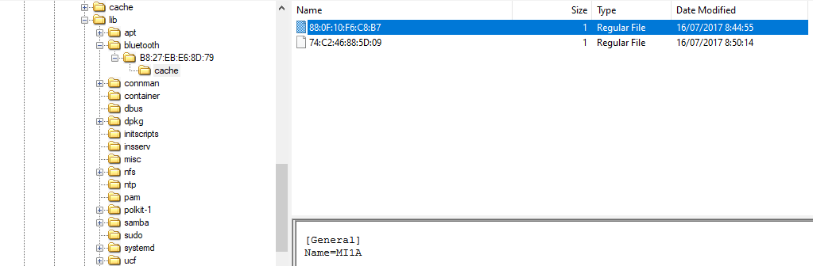

- El segundo dispositivo correspondía a un **Amazon Echo** (altavoz inteligente).

    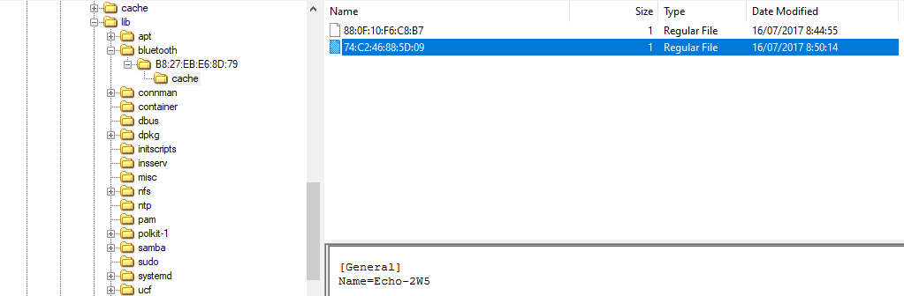

En este caso resulta especialmente relevante porque el marido declaró que **"no pudo haber escuchado nada ya que estaba usando auriculares debido a que su mujer había puesto música"**. Sin embargo, ninguno de los dispositivos conectados por Bluetooth corresponde a unos auriculares, sino que se trata de un móvil y un altavoz inteligente, lo cual genera una importante contradicción con su testimonio.

---

### Análisis Alexa

#### Material entregado para análisis

Se recibió para análisis un conjunto de archivos extraídos del dispositivo **Amazon Alexa**. Este material incluye 14 grabaciones de audio en formato ``WAV``, varios archivos ``JSON`` con metadatos asociados a dichas grabaciones, y capturas de pantalla del historial de comandos realizados al dispositivo.

#### Análisis de archivos de audio

| **Archivo** | **Hora**  | **Voz**                  | **Contenido**                   | **Observaciones**                         |
| ------- | ----- | -------------------- | --------------------------- | ------------------------------------- |
| 1.wav   | 15:20 | Masculina            | "Alexa, call ambulance!"    | Repetido en 2.wav                     |
| 2.wav   | 15:20 | Masculina            | "Alexa, call ambulance!"    | Igual a 1.wav                         |
| 3.wav   | 15:20 | Masculina            | "Alexa, turn off TV"        | Repetido en 4.wav                     |
| 4.wav   | 15:20 | Masculina            | "Alexa, turn off TV"        | Igual a 3.wav                         |
| 5.wav   | 15:13 | Femenina             | "Alexa, ... stop"           | Música de fondo, pausa entre palabras |
| 6.wav   | 15:12 | Femenina             | "Alexa, ... stop"           | Igual a 5.wav                         |
| 7.wav   | 15:12 | Femenina y Masculina | Conversación corta          | Archivo JSON vacío                    |
| 8.wav   | 15:12 | Femenina y Masculina | Fragmentos conversacionales |                                       |
| 9.wav   | 15:06 | Femenina             | "Alexa, turn on Pandora"    | Aplicación de música Pandora          |
| 10.wav  | 15:06 | Femenina             | "Alexa, turn on Pandora"    | Igual a 9.wav                         |
| 11.wav  | 15:01 | Masculina            | "Alexa, turn on TV"         | Repetido en 12.wav                    |
| 12.wav  | 15:01 | Masculina            | "Alexa, turn on TV"         | Igual a 11.wav                        |
| 13.wav  | 14:45 | Varias               | Conversación informal       | Parece demostración del dispositivo   |
| 14.wav  | 14:57 | Masculina            | Incomprensible              |                                       |

#### Análisis de archivos JSON e historial de comandos

Los archivos JSON asociados y las imágenes del historial de consultas permitieron corroborar la secuencia de comandos realizados a Alexa y el contexto temporal de la actividad. Estos registros aportan detalles adicionales sobre los momentos en que se realizaron las interacciones y la naturaleza de las solicitudes al dispositivo, enriqueciendo el análisis general de la actividad digital en la escena.

---

### Análisis tráfico de red smarthome

Para el tráfico de red, se ha investigado exhaustivamente a través de la herramienta open source `NetworkMiner`.

Hemos investigado los dos archivos `.pcap` y se ha encontrado dos direcciones IP, la `203.253.250.32` asociada a un dispositivo de Samsung.


Y también se ha encontrado la IP `203.253.250.34` asociada a la empresa surcoreana de telecomunicaciones `EFM Networks`.


La cuál puede ser uno de los siguiente posibles dispositivos:

- Amazon Fire TV Stick
- EZProxy
- Google Home/Nest

Tambien se ha revisado archivos compartidos en los que solo hay archivos que comparten los dispositivos para mantenerse actualizados y enlazados.


Por último, se han revisado las consultas DNS, donde no se ha encontrado nada relevante para el caso.


El análisis realizado sobre el tráfico de red del entorno domótico no ha permitido identificar información relevante para el caso investigado. No se observaron comunicaciones sospechosas ni indicios de que los dispositivos conectados hubieran sido manipulados de forma intencionada. A lo largo del estudio se logró confirmar que los dispositivos presentes estaban conectados de manera habitual y que el comportamiento general de la red coincidía con el funcionamiento normal de un hogar equipado con tecnología inteligente.

---

### Análisis informe diagnóstico Google OnHub

Para extraer hallazgos del informe lo que hicimos fue realizar un análisis exhausto, en búsqueda de información clave, acerca del caso. Encontramos información como su modelo, su sistema operativo `Chrome OS`, versión `9460.40.5` e incluso su identificación `WHIRLWIND DOGFOOD`. Es un router Wi-Fi doméstico lanzado por Google en 2015, fabricado en colaboración con TP-Link y ASUS. También encontramos información como los servidores DNS configurados, en este caso los 2 de Google `8.8.8.8` y `8.8.4.4`, además de otro que parecía estar localizado en Corea del Sur como podimos obtener a través de la herramienta `WhoIs`. 


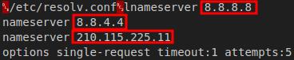

Pudimos comprobar conforme seguíamos avanzando por el informe, los diferentes dispositivos que estaban conectados al router en el momento de realizar la adquisición. Encontramos un total de 9 dispositivos conectados y un total de 13 conexiones distintas. Algunos de estos dispositivos están conectados a más de una interfaz de red. También conseguimos encontrar diferentes `SSID` de las redes, dónde sacamos como conclusión que había una red principal, otra red para invitados y una red mesh, es decir una red en malla.

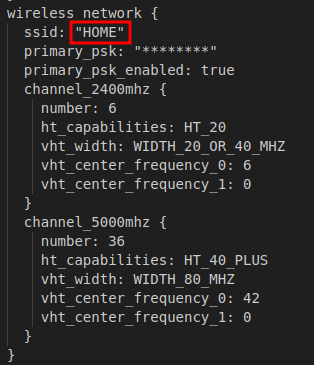

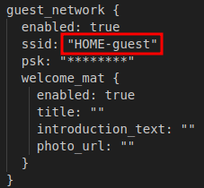

Por último, descubrimos todas las interfaces de red que tiene el router, siendo un total de 13. En este apartado, podemos comprobar como las interfaces que tienen una IP asignadas son `br-lan` y `br-guest`. Si tenemos en cuenta esta información, además de la información mencionada anteriormente sobre los dispositivos conectados, podemos sacar la conclusión de que había 9 dispositivos conectados a la red `br-lan`, 1 dispositivo conectado a la red `wan-0`, 2 dispositivos con IP fuera de rango, y 1 dispositivo conectado a la red `br-guest` dentro del rango.

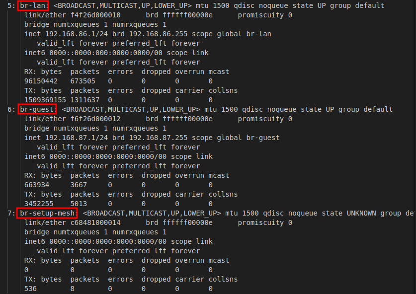

---

### Línea del tiempo


<br>

## Limitaciones del análisis

El análisis se llevó a cabo con éxito, accediendo a la mayoría de los dispositivos relevantes y preservando la integridad de los datos. No se identificaron limitaciones que comprometieran la validez de los hallazgos presentados.


<br>

## Conclusiones

El análisis realizado permitió identificar y preservar hallazgos digitales relevantes de múltiples dispositivos vinculados a la escena del crimen. La reconstrucción de la línea temporal basada en registros digitales aportó información clave para contrastar los testimonios y comprender la secuencia de eventos.

Aunque algunas limitaciones impidieron acceder a la totalidad de los datos, el conjunto de hallazgos ofrece una base sólida para avanzar en la investigación. El uso de metodologías y herramientas forenses reconocidas garantizó la integridad y trazabilidad del proceso.

En definitiva, este informe proporciona una visión clara y detallada de la actividad digital registrada en la escena, facilitando la interpretación técnica y no técnica de los hechos analizados.

<br>

---

## Anexos

## Anexo 1 - Hallazgos

### 1 - Móvil víctima

#### Hallazgo 1: Información relevante del teléfono móvil

| **Campo** | **Detalle** |
| ----------------------------- | ------------------------------------------------------------------------------------------------------------------------------------------------------------------------------------------------------------------------------------------------------------------- |
| **Ruta de los fichero** | `USERDATA/data/com.android.email/databases/EmailProvider.db` - `USERDATA/misc/bluedroid/bt_config.xml` |
| **Contenido del fichero** | Información relevante sobre datos de correo electrónicos, dispositivos bluetooth conectados al dispositivo, datos específicos del dispositivo |
| **Datos del dispositivo** | El dispositivo analizado es un Samsung Galaxy Note II LTE (modelo SHV-E250L) fabricado por Samsung, con identificador interno t0ltelgt, procesador Exynos 4 y sistema operativo Android 4.4.2. Su número de serie es 4300d1b15be8b061 y la fecha de compilación corresponde al 24 de agosto de 2015 a las 16:27:41 KST. Aunque la región configurada es Reino Unido (en-GB) y el idioma del sistema es inglés, el dispositivo opera en la zona horaria de Asia/Seúl (KST). Además, tiene activado el sistema de seguridad Knox y está personalizado con el nombre "Betty (SHV-E250L)". La cuenta de correo principal asociada es bettyhallym@gmail.com. El teclado está configurado para los idiomas coreano e inglés estadounidense y el dispositivo recuerda varias redes Wi-Fi, entre las que destacan DFIRE, HOME y home. |
| **Valor hash (SHA-256)** | c3e334c996b811c51067e9e0657cb621523576f15eb2c19ec52c32bf36e3e5ff |

---

### 2 - Móvil marido de la víctima

#### Hallazgo 2: Información relevante del teléfono móvil

| **Campo** | **Detalle** |
| ----------------------------- | ------------------------------------------------------------------------------------------------------------------------------------------------------------------------------------------------------------------------------------------------------------------- |
| **Ruta de los fichero** | `/img_SHV-E250S_Physical_20170718_USERDATA.mdf/system` - `/img_SHV-E250S_Physical_20170718_USERDATA.mdf/misc/bluedroid` |
| **Contenido del fichero** | Información relevante sobre dispositivos bluetooth conectados al dispositivo y datos específicos del dispositivo, búsquedas en Internet, aplicaciones instaladas |
| **Observaciones** | Se trata de un Samsung Galaxy Note II (SHV-E250L) que funciona con Android 4.4.2 y un firmware oficial distribuido en Corea, lo que concuerda con su procedencia. Destaca la presencia de aplicaciones multimedia, de reproducción en red (como Kodi/XBMC), aplicaciones de música en streaming coreana, y utilidades como Chrome y YouTube. Además, el dispositivo tenía un historial de conexiones Bluetooth con varios equipos, entre ellos otro móvil similar (Betty SHV-E250L), un altavoz inteligente (Echo-2W5), una pulsera inteligente (MI1A), unos auriculares inalámbricos (LG HBS900) y otros dispositivos. No se encontraron datos relevantes en el historial de navegación ni en las búsquedas web. Todo ello indica un uso orientado tanto al ocio como a la conectividad doméstica, así como su integración habitual con otros dispositivos del hogar |
| **Valor hash (SHA-256)** | 5a46acdf7fb5a70734a2e0e39a8c9b5cc9b7ee799fe800a0a7512af08e15c025 |

---

### 3 - Dispositivo Raspberry Pi

#### Hallazgo 3: Ejecución película en dispositivo Raspberry Pi

| **Campo** | **Detalle** |
| ----------------------------- | ------------------------------------------------------------------------------------------------------------------------------------------------------------------------------------------------------------------------------------------------------------------- |
| **Ruta del fichero** | `/home/osmc/.kodi/temp`|
| **Contenido del fichero** | 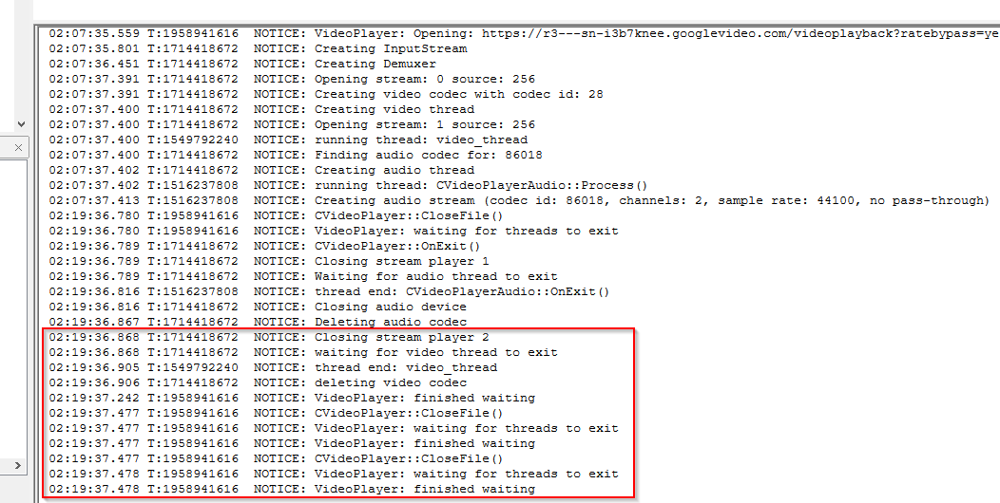 |
| **MAC Time** | 17/07/2015 02:19:37 UTC-4 |
| **Valor hash (SHA-256)** | 5423ea3f60d4ad0874346d3ba31c8783e5f2ce4b15b261ba0085e07f11e650e6 |

---

#### Hallazgo 4: Dispositivos bluetooth conectados a dispositivo Raspberry Pi

| **Campo** | **Detalle** |
| ----------------------------- | ------------------------------------------------------------------------------------------------------------------------------------------------------------------------------------------------------------------------------------------------------------------- |
| **Ruta del fichero** | `/lib/bluetooth`|
| **Contenido del fichero** |   |
| **MAC Time** | 16/07/2015 08:44:55 UTC-4 - 16/07/2015 08:50:14 UTC-4 |
| **Valor hash (SHA-256)** | 5423ea3f60d4ad0874346d3ba31c8783e5f2ce4b15b261ba0085e07f11e650e6 |

---

### 4 - Dispositivo Alexa:

#### Hallazgo 5: Registro de actividad relevante en dispositivo Alexa

| **Campo** | **Detalle** |
| ----------------------------- | ------------------------------------------------------------------------------------------------------------------------------------------------------------------------------------------------------------------------------------------------------------------- |
| **Tipo de hallazgo** | Archivos de audio en formato WAV y documentos JSON relacionados |
| **Contenido del fichero** | Conjunto de 14 grabaciones de voz con comandos dirigidos al asistente, además de imágenes del historial de consultas|
| **MAC Time** | Actividades registradas el 17 de julio de 2017, entre aproximadamente las 15:01 y 15:20 horas locales |
| **Tamaño lógico del fichero** | Varía según cada archivo; no se establece un tamaño único |
| **Valor hash (SHA-256)** |  6c09813eea5475dc0011c547e7fb774cfbd7216cafdeeb9a8308306046c14edf |
| **Observaciones** | Se identifican órdenes críticas, incluyendo solicitudes para llamar a emergencias y controlar dispositivos multimedia. Asimismo, se detectan indicios de diálogo conflictivo entre dos voces. El periodo registrado coincide con el momento del suceso investigado. |

---

### 5 - Dispositivo Google OnHub:

#### Hallazgo 6: Registro de actividad relevante en dispositivo Alexa

| **Campo** | **Detalle** |
| ----------------------------- | ------------------------------------------------------------------------------------------------------------------------------------------------------------------------------------------------------------------------------------------------------------------- |
| **Ruta del fichero** | `/etc/resolv.conf` - `/proc/net/arp` - Archivos extraídos del sistema |
| **Tipo de hallazgo** | Interfaces de red - Redes Wifi - Dispositivos conectados - Datos del dispositivo |
| **Contenido del fichero** | Salidas de comandos, archivos de confiruación, direcciones IP, dispositivos conectados al sistema |
| **Valor hash (SHA-256)** |  4767513d714698afcd7506dd2304528a8db8243e2dff1be6e1ede591d0d19f83 |
| **Observaciones** | Se trata de un router Wi-Fi doméstico lanzado por Google en 2015 y fabricado en colaboración con TP-Link y ASUS. El dispositivo se ejecuta Chrome OS (versión 9460.40.5) sobre hardware identificado como "WHIRLWIND DOGFOOD" con procesador Qualcomm 8064. En cuanto a la configuración de red, utiliza los DNS públicos de Google (8.8.8.8 y 8.8.4.4) y también uno de Corea del Sur, lo que puede aportar contexto geográfico relevante. El router dispone de varias redes Wi-Fi configuradas, incluyendo una red principal, una de invitados y una red mesh, y soporta distintas interfaces de red internas. El volcado de la tabla ARP revela que en el momento de la adquisición había nueve dispositivos conectados a la red principal (br-lan), uno a la interfaz wan-0, dos con IP fuera de rango, y uno más en la red de invitados (br-guest), lo que evidencia un entorno de red doméstico activo y diverso. |

---

<br>

## Anexo 2 - Cadena de custodia

| Sección | Campo |
| :---- | :---- |
| **1. INFORMACIÓN DEL CASO** |  |
| Número de Caso | 09 |
| Tipo de Investigación | Análisis forense |
| Fecha de Adquisición | 08/05/2025, 10:30 |
| Lugar de Adquisición | C/Pericón de Cádiz ,s/n–11002,Cádiz(Cádiz)|
| Recibido por | Manuel Jesús Rivas Sández |
| **2. DESCRIPCIÓN DEL HALLAZGO EN ORIGINAL** |  |
| **Tipo de Dispositivo** | **Router de Google** |
| Nombre del archivo | InformeDiagnosticoOnHub |
| Hash del Hallazgo Original (MD5) | 4a07bd78d8f4ba227841c971eeb7d1b3 |
| Hash del Hallazgo Original (SHA256) | 4767513d714698afcd7506dd2304528a8db8243e2dff1be6e1ede591d0d19f83 |
| **Tipo de Dispositivo** | **Medio de almacenamiento** |
| Nombre del archivo | Tráfico_SmartHome_PorCOAP.pcap |
| Hash del Hallazgo Original (MD5) | 67ab09760148a66402aa7d9b0abaa322 |
| Hash del Hallazgo Original (SHA256) | f5ad42a50ca0d16261c1ca4742d78fd99c9e7fc6ab67fdb3a53909ff7f786ce0 |
| **Tipo de Dispositivo** | **Medio de almacenamiento** |
| Nombre del archivo | Tráfico_SmartHome_PorIP.pcap |
| Hash del Hallazgo Original (MD5) | 8fb0edb521c9ad191adf55054203a6f4 |
| Hash del Hallazgo Original (SHA256) | a4664f1719d26382edd6d352cc8715fea3ee73bbb00245d71943fbacbbeeca3e |
| **Tipo de Dispositivo** | **Altavoz inteligente con asistente virtual** |
| Nombre del archivo | Alexa.zip |
| Hash del Hallazgo Original (MD5) | 4a07bd78d8f4ba227841c971eeb7d1b3 |
| Hash del Hallazgo Original (SHA256) | 4767513d714698afcd7506dd2304528a8db8243e2dff1be6e1ede591d0d19f83 |
| **Tipo de Dispositivo** | **Smartphone** |
| Nombre del archivo | smartphone_victima.zip |
| Hash del Hallazgo Original (MD5) | 8daf9d23e39675452f99c5099a72b317 |
| Hash del Hallazgo Original (SHA256) | c3e334c996b811c51067e9e0657cb621523576f15eb2c19ec52c32bf36e3e5ff |
| **Tipo de Dispositivo** | **Smartphone** |
| Nombre del archivo | smartphone_marido_victima.zip |
| Hash del Hallazgo Original (MD5) | 1472be511173e7e0f4919958b1c96ffe |
| Hash del Hallazgo Original (SHA256) | 5a46acdf7fb5a70734a2e0e39a8c9b5cc9b7ee799fe800a0a7512af08e15c025 |
| **Tipo de Dispositivo** | **Televisión** |
| Nombre del archivo | TV_Inteligente.zip |
| Hash del Hallazgo Original (MD5) | d9d2b3b3048a836289cec02c6353b6e9 |
| Hash del Hallazgo Original (SHA256) | 5423ea3f60d4ad0874346d3ba31c8783e5f2ce4b15b261ba0085e07f11e650e6 |
| **3. PRESERVACIÓN DEL HALLAZGO ORIGINAL** |  |
| Fecha de Entrega | 08/05/2025 |
| Hora de Entrega | 10:30 |
| Recibido por | Manuel Jesús Rivas Sández |
| **4. CREACIÓN Y VERIFICACIÓN DE COPIAS** |  |
| Fecha y Hora de Creación | 09/05/2025, 20:00 |
| Técnico Responsable | Álvaro Caro Fernández |
| Verificación de Integridad | Sí |
| Entregado a | Manuel Rivas Sández |
| Fecha y Hora de Entrega | 15/05/2025, 23:45 |
| **5. REGISTRO DE ACCESOS Y VERIFICACIONES** |  |
| Fecha y Hora | 10/05/2025, 10:00 |
| Propósito | Análisis de hallazgos |
| Técnico | Ángel Alberto Martínez Sánchez |
| Verificación de Integridad | Sí |

<br>

## Anexo 3 - Metodología

La metodología aplicada en esta investigación se fundamentó en un enfoque forense digital estructurado, orientado a preservar la integridad de los datos y garantizar la trazabilidad de los procesos. El análisis se dividió en las siguientes fases principales:

### Identificación y recolección

Se identificaron los dispositivos digitales presentes en la escena del crimen, incluyendo smartphones, pulseras inteligentes, sensores IoT, asistentes de voz, routers y otros artefactos conectados. Se procedió a la adquisición forense de la información almacenada en estos dispositivos, utilizando técnicas y herramientas especializadas para asegurar la integridad de los datos.

### Preservación y verificación

Los hallazgos digitales fueron preservados mediante imágenes forenses y copias de seguridad, verificándose su integridad a través de algoritmos hash (SHA-1 y SHA-256). Se documentaron exhaustivamente todos los procedimientos para asegurar la cadena de custodia y la reproducibilidad del análisis.

### Análisis y correlación

Se analizaron los datos extraídos, incluyendo registros de actividad, logs de sensores y comunicaciones de red, con el objetivo de reconstruir la línea temporal de los eventos. Se contrastaron estos datos con los testimonios proporcionados, buscando patrones que permitieran esclarecer la secuencia de hechos.

### Interpretación y reporte

Por último, se interpretaron los resultados obtenidos para elaborar un informe claro y accesible, destinado a apoyar la investigación con hallazgos precisos y verificables, manteniendo un lenguaje comprensible para audiencias técnicas y no técnicas.

<br>

## Anexo 4 - Juramento y tacha

### Juramento  
Nosotros, el equipo de investigación, declaramos bajo juramento que el presente informe de análisis forense ha sido elaborado con total imparcialidad, profesionalismo y rigor técnico. Todas las actividades realizadas durante la investigación se llevaron a cabo respetando los principios éticos y legales aplicables.

Certificamos que los hallazgos, análisis y conclusiones incluidos en este informe reflejan fielmente los resultados obtenidos, sin omitir ni alterar información relevante para su correcta interpretación.

### Tacha  
En cumplimiento con las mejores prácticas y estándares de la industria, declaramos que no existe conflicto de interés alguno que pueda comprometer la objetividad de este informe. Asimismo:

- No mantenemos relación personal ni profesional con las partes involucradas en el incidente fuera del ámbito de este proyecto.  
- No hemos recibido incentivos externos que puedan influir en la elaboración o resultados del informe.  
- Nos comprometemos a preservar la confidencialidad de toda la información manejada durante la investigación, conforme a los acuerdos establecidos.

Firmado electrónicamente por:


Fecha: 15 de mayo de 2025