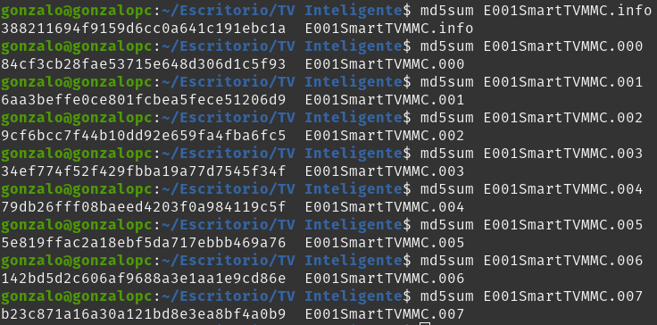
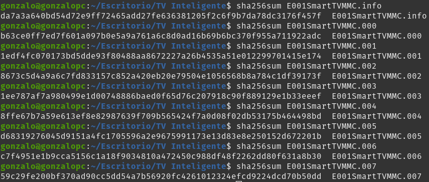
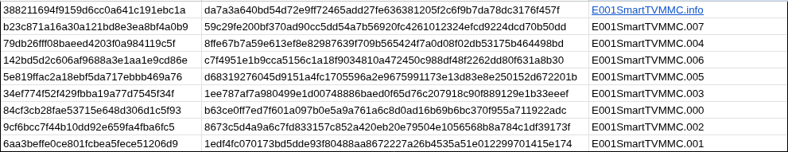
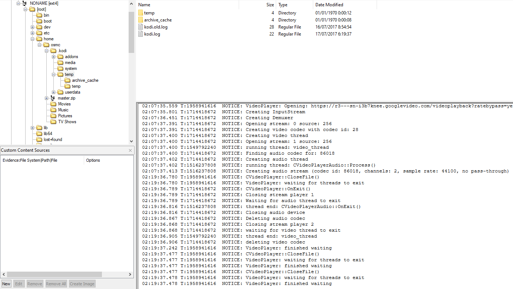
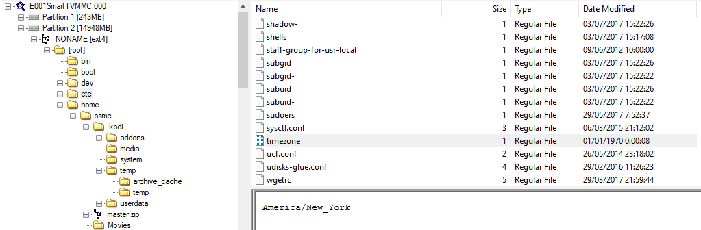
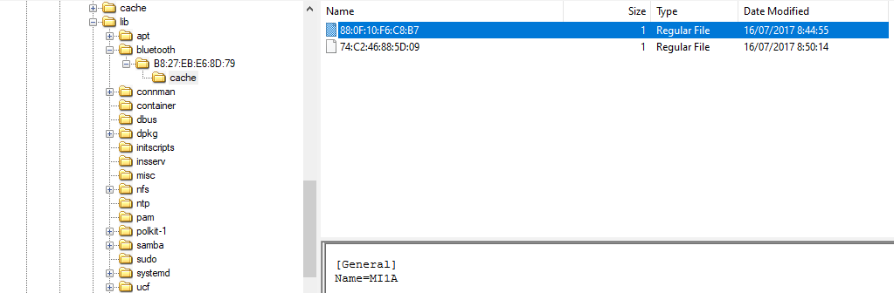
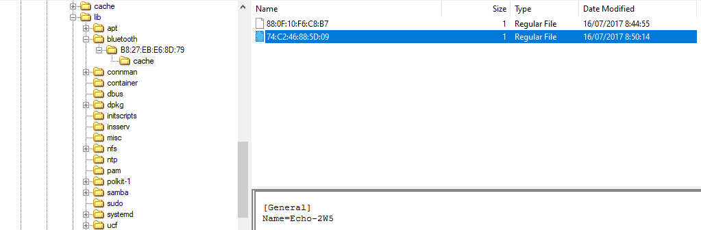

# Investigacion

La primera tarea sera calcular los hashes de los fragmentos de imagen del dispositivo, ver que coinciden y asi asegurar la legitimidad.

- **Hashes MD5**
  

- **Hashes SHA256**
  

- **Comprobar hashes**

Podemos observar que todos los hashes coinciden.

## 1.  kodi.log

Este archivo se encuentra en la ruta: `/home/osmc/.kodi/temp`.

Con los logs de kodi, podemos observar que termina de ver un video a las **2:19:37**. Vamos a asegurarnos de que la hora realmente es correcta.

Si buscamos en el sistema el archivo `timezone`, observamos que la zona horaria es **America_NewYork**.
Esta zona horaria es `UTC-4`, pero en el caso, nos pone `UTC+9`, asi que si hacemos la conversion, queda la hora **3:19:37**.
Esto nos verifica que se encontraba en casa a esa hora.

## 2. Dispositivos Bluetooth

Para ver los archivos de Bluetooth accedemos a la siguiente ruta: `/lib/bluetooth`.

Dentro nos encontramos 2 archivos (que nos da informacion de que habia 2 dispositivos conectados).

- **Dispositivo 1**
  

Este dispositivo es un movil de Xiaomi

- **Dispositivo 2**

Este dispositivo se refiere a Amazon Echo (Altavoces).

El marido, nos cuenta que **"no pudo haber escuchado nada ya que estaba usando auriculares debido a que su mujer había puesto música"**, pero ninguno de estos dispositivos son auriculares.

