# Google OnHub

Este dispositivo consiste en un router Google OnHub, un router Wi-Fi doméstico lanzado por Google en 2015, fabricado en colaboración con TP-Link y ASUS. Está diseñado para ofrecer una experiencia de red sencilla y optimizada para usuarios no técnicos.

## Calculo de Hashes

Como primer paso, se realizó la verificación de la integridad de los archivos obtenidos. Para ello, calculamos los hashes SHA256 y MD5 de todos los archivos y se compararon con los valores originales proporcionados.

**Hashes originales:**
| **Archivo** | **SHA-256** | **MD5** |
| -------------------------------- | ---------------------------------------------------------------- | -------------------------------- |
| InformeDiagnosticoOnHub | 4767513d714698afcd7506dd2304528a8db8243e2dff1be6e1ede591d0d19f83 | 4a07bd78d8f4ba227841c971eeb7d1b3 |

**Hashes verificados:**

## Información del fichero

El fichero que tenemos para analizar es un volcado de información técnica y logs del dispositivo OnHub.

---

### Información del sistema y firmware

En el primer análisis del fichero encontramos los siguientes datos principales:

**- Sistema operativo:** Chrome OS, versión 9460.40.5, canal estable, placa "whirlwind-signed-mpkeys".

**- Hardware:** Dispositivo identificado como "WHIRLWIND DOGFOOD", procesador Qualcomm 8064.

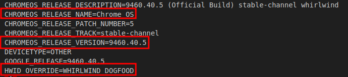

---

### Red y conectividad

Encontramos los siguientes servidores DNS configurados:

`8.8.8.8`, `8.8.4.4` (Google), y `210.115.225.11`.

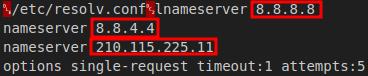

Del último no tenemos información de que sea un servidor DNS conocido por lo que usamos la herramienta `Whois` para obtener más información sobre este servidor:

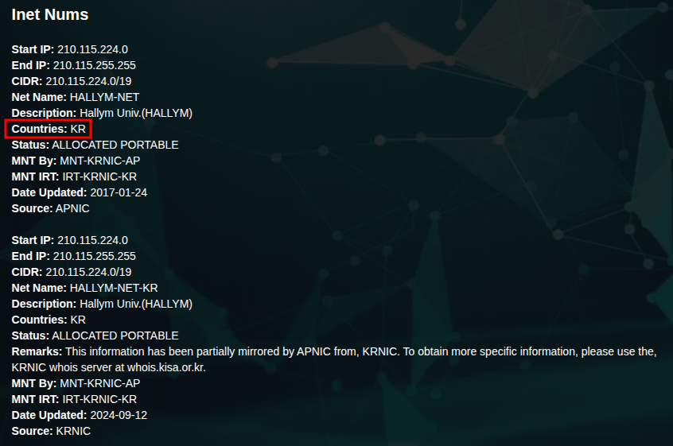

A través de esta herramienta podemos comprobar que esta IP pertenece a Corea del Sur.

---

### Dispositivos conectados

El fichero `/proc/net/arp` es una instantánea de la tabla ARP del router, mostrando qué dispositivos (por IP y MAC) estaban conectados a la red local y por qué interfaz en el momento de la adquisición.

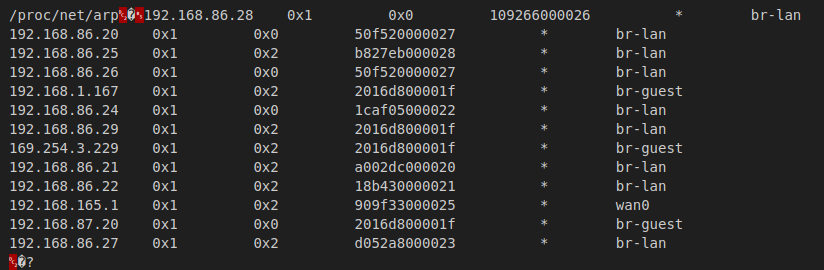

---

### Redes Wifi

Encontramos los `SSID` de diferentes redes `Wifi`:

La **red wifi principal** que tiene el nombre `HOME`:

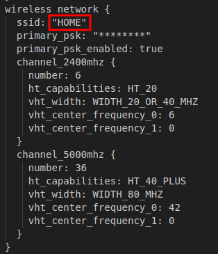

Una **red de invitados** con el nombre `HOME-guest`:

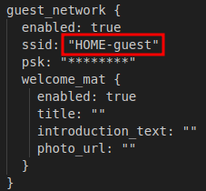

Una red `mesh`:

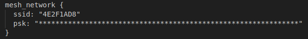

---

### Interfaces de red

Encontramos las siguientes intefarces de red que tenía el dispositivo:

| Interfaz           | Dirección IP / Máscara     |
|--------------------|----------------------------|
| lo                 | 127.0.0.1/8                |
| wan0               | 192.168.165.9/24           |
| lan0               |                            |
| qca-nss-dev0       |                            |
| br-lan             | 192.168.86.1/24            |
| br-guest           | 192.168.87.1/24            |
| br-setup-mesh      |                            |
| br-station-mode    |                            |
| wlan-2400mhz       |                            |
| wlan-5000mhz       |                            |
| aux-radio0         |                            |
| guest-2400mhz      |                            |
| guest-5000mhz      |                            |

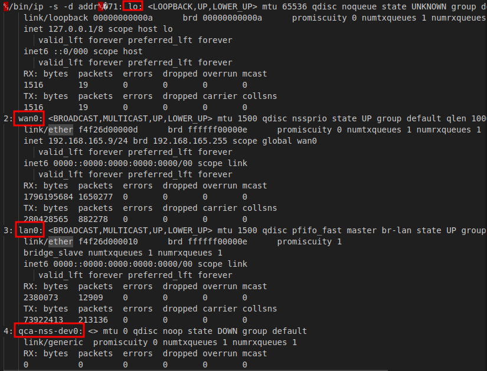
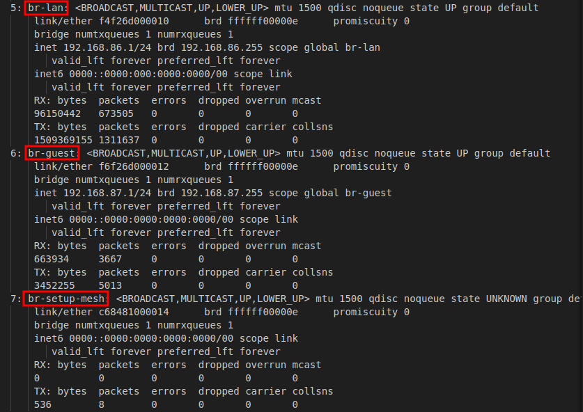
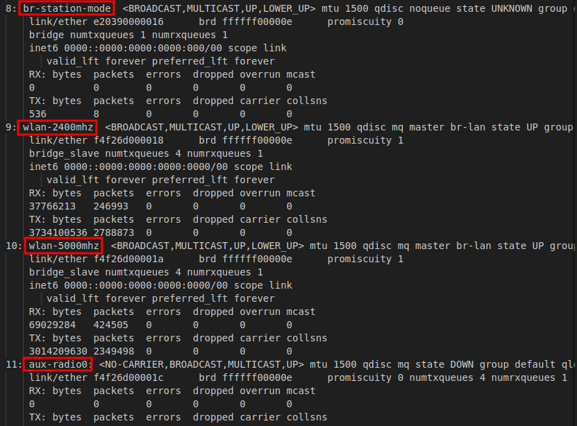
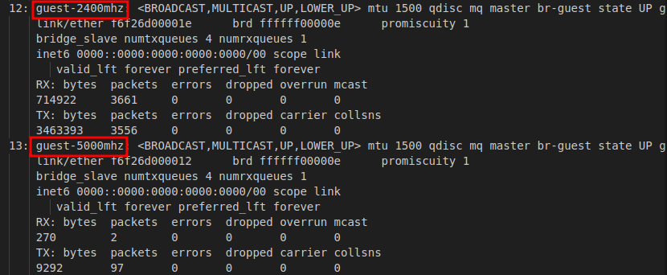

## Conclusión

Como conclusión, podemos sacar la información de que había 9 dispositivos conectados a la red `br-lan`, 1 dispositivo conectado a la red `wan-0`, 2 dispositivos con IP fuera de rango, y 1 dispositivo conectado a la red `br-guest` dentro del rango.