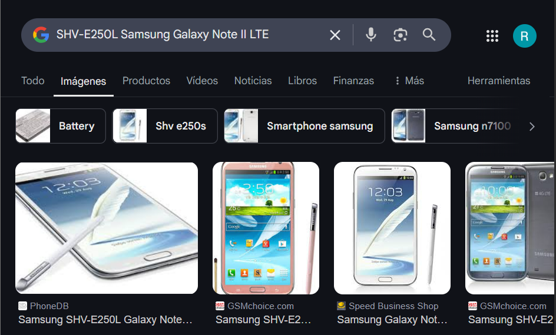
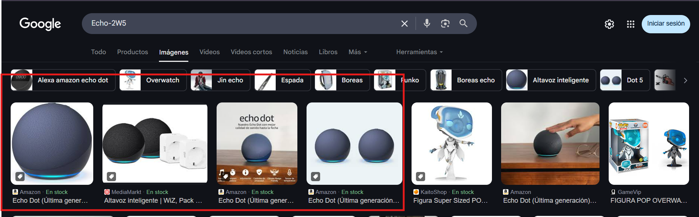

# Investigación sobre el móvil de la víctima

Para la investigación de este dispositivo he cosultado el siguiente enlace el cual contiene una cheatsheet para buscar información el algunos archivos de interés. [Enlace a cheatsheet](https://pbs.twimg.com/media/FL-GAXBUUAEJRZq.jpg)

Después de la investigación en los diferentes archivos encontramos lo siguiente:

- El modelo del móvil es: SHV-E250L (Samsung Galaxy Note II LTE)

- El fabricante del modelo es: Samgsung

- El identificador interno del dispositivo: t0ltelgt

- El sistema operativo: Android 4.4.2

- El número de serie: 4300d1b15be8b061

- El procesador: Exynos 4

- La fecha de compilación: 24 de agosto de 2015, 16:27:41 KST

- La región configurada: Reino Unido (en-GB)

- El idioma del sistema: Inglés

- El sistema de seguridad Knox: Activado

- La zona horaria del dispositivo: Asia/Seúl (KST)

- La cuenta de correo principal: bettyhallym@gmail.com

- El nombre del dispositivo: Betty (SHV-E250L)

- Los idiomas del teclado: Coreano, Inglés estadounidense

- Redes conocidas: DFIRE, HOME, home

## Revisión de bases de datos y correos electrónicos

Se accedió al archivo de base de datos de correos electrónicos (USERDATA/data/com.android.email/databases/EmailProvider.db). En su interior se hallaron mensajes redactados en coreano. Tras traducirlos, se constató que se trataba de comunicaciones de carácter rutinario, sin contenido relevante para la investigación. Algunos ejemplos traducidos incluyen:

- "Te llamaré más tarde."

- "Gracias por enviarme el correo electrónico."

- "Por favor, contáctame a mi teléfono móvil."

- "Vamos a almorzar juntos."

- "Avísame más tarde."

## Investigación aplicaciones instaladas

Se revisaron las aplicaciones presentes en el terminal, sin encontrar información significativa para el caso.

## Dispositivos Bluetooth vinculados

En la ruta USERDATA/misc/bluedroid/bt_config.xml se identificaron registros de conexiones Bluetooth recientes. Los dispositivos detectados fueron:

- Amazon Echo:

    - Nombre: Echo-2W5

    - Dirección MAC: 74:c2:46:88:5d:09

    - Identificado como un altavoz inteligente tipo Alexa.

- Teléfono del esposo:

    - Nombre: Simon (SHV-E250S)

    - Dirección MAC: 50:f5:20:a5:7d:cc

    - Dispositivo móvil asociado al esposo de la víctima.

- Pulsera inteligente:

    - Nombre: MI1A

    - Dirección MAC: 88:0f:10:f6:c8:b7

    - Se deduce que corresponde a una smartband, aunque no se ha podido determinar el modelo exacto.

## Conclusión

La inspección del terminal permitió identificar los parámetros técnicos del dispositivo, las cuentas asociadas y los dispositivos Bluetooth conectados. No se hallaron mensajes ni archivos que aporten información relevante directamente relacionada con el caso. El análisis de los correos electrónicos y las aplicaciones instaladas no arrojó resultados de interés para la investigación.
