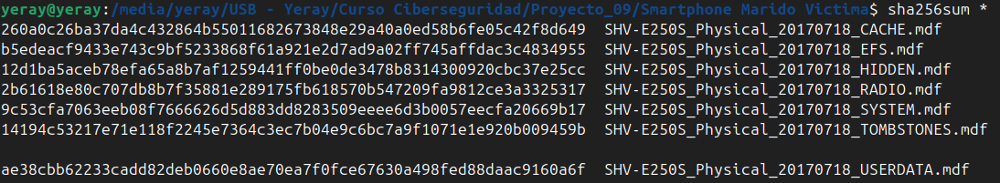
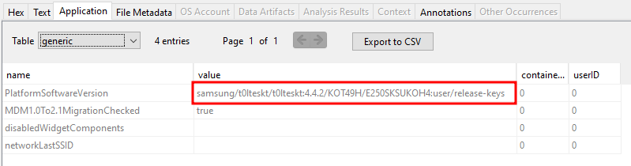
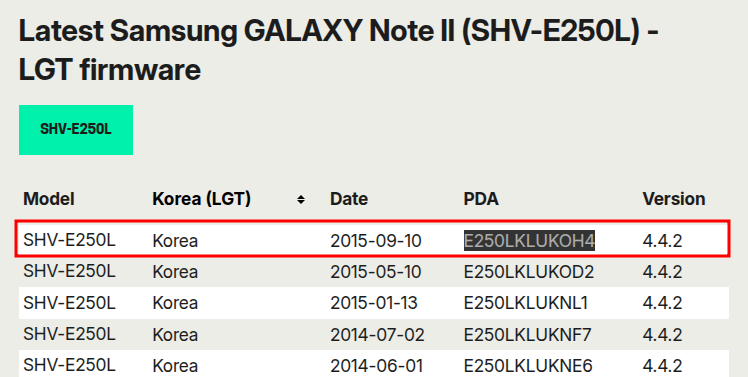
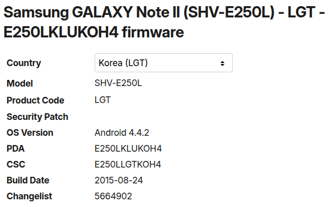
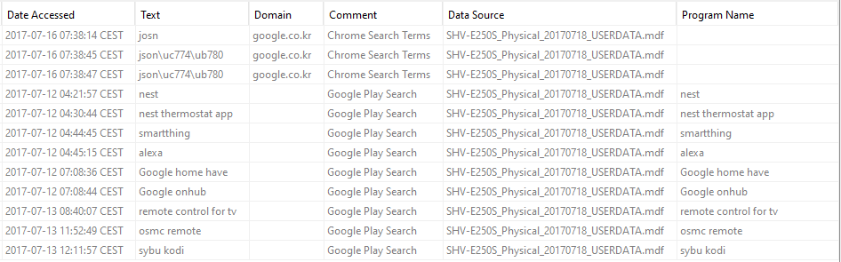
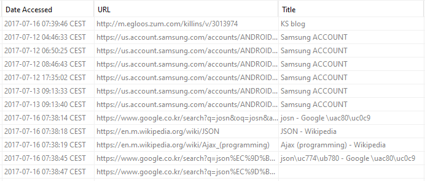
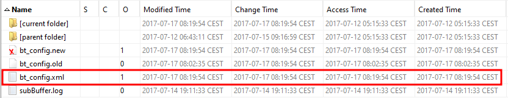
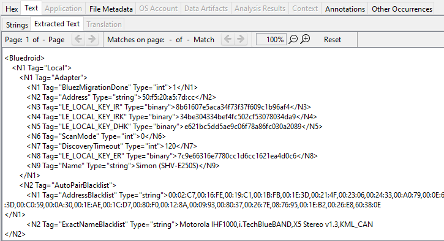

# Toma de nota - Smartphone del marido de la víctima

## Calculo de Hashes

Como primer paso, se realizó la verificación de la integridad de los archivos obtenidos del volcado físico del dispositivo. Para ello, se calcularon los hashes SHA256 de todos los archivos y se compararon con los valores originales proporcionados.

Calculo del hash SHA256:



Hashes originales:

```txt
20971761,09c2d33552fd786979617a492868462f,b5edeacf9433e743c9bf5233868f61a921e2d7ad9a02ff745affdac3c4834955,SHV-E250S_Physical_20170718_EFS.mdf
1342177525,bf203a2480d3db70d9df6831662f510a,260a0c26ba37da4c432864b55011682673848e29a40a0ed58b6fe05c42f8d649,SHV-E250S_Physical_20170718_CACHE.mdf
268435711,d9dac42e279ab6adbed5cadc476c6943,14194c53217e71e118f2245e7364c3ec7b04e9c6bc7a9f1071e1e920b009459b,SHV-E250S_Physical_20170718_TOMBSTONES.mdf
92274933,438f7454f4f00f7e069e5b19c2cb33c9,2b61618e80c707db8b7f35881e289175fb618570b547209fa9812ce3a3325317,SHV-E250S_Physical_20170718_RADIO.mdf
587202807,ad2ab83a8ffa2bf32815f2a816f2ca25,12d1ba5aceb78efa65a8b7af1259441ff0be0de3478b8314300920cbc37e25cc,SHV-E250S_Physical_20170718_HIDDEN.mdf
2516582647,cadc3ed911224bd40693c50115985ae6,9c53cfa7063eeb08f7666626d5d883dd8283509eeee6d3b0057eecfa20669b17,SHV-E250S_Physical_20170718_SYSTEM.mdf
26377978107,17d83e6dc8336b6b4d30d93f0ce9d2a5,ae38cbb62233cadd82deb0660e8ae70ea7f0fce67630a498fed88daac9160a6f,SHV-E250S_Physical_20170718_USERDATA.mdf
```

Verificando los resultados muestran que los hashes SHA256 coinciden perfectamente con los originales, lo que garantiza que los archivos analizados no han sido modificados ni alterados durante el proceso de adquisición.

---

## Investigación y Análisis

### Identificación del Dispositivo

Se ha utilizado la herramienta [Autopsy 4.22.1](https://www.autopsy.com/) para esta investigacion.

La mayor parte de la información relevante se encuentra en el archivo **USERDATA**, por lo que el análisis se centró inicialmente en dicho archivo.

En el directorio `/img_SHV-E250S_Physical_20170718_USERDATA.mdf/system`, se localizaron varias bases de datos de interés. La base de datos `enterprise.db`, específicamente en la tabla `generic`, proporcionó información clave sobre el dispositivo:



- **Modelo:** Samsung Galaxy Note II (SHV-E250L)
- **Sistema Operativo:** Android 4.4.2
- **Firmware:** E250LKLUKOH4



La información del dispositivo corresponde a una versión oficial distribuida en Corea, lo que concuerda con el modelo y la procedencia del terminal.



El análisis de la base de datos `dmappmgr.db` permitió identificar las aplicaciones instaladas y registrar la última vez que fueron ejecutadas. Entre las aplicaciones encontradas destacan:

| **__id** |                    **pkgname**                     | **lastLaunchTime (Epoch Time)** | **lastLaunchTime (GMT+9)** |
| :------: | :------------------------------------------------: | :-----------------------------: | :------------------------: |
|  **1**   |    com.sec.android.cloudagent.dropboxoobe:0    |          1499829461056          |  Mie Jul 12 2017 12:17:41  |
|  **2**   |         com.sec.android.app.launcher:0         |          1500276641203          |  Lun Jul 17 2017 16:30:41  |
|  **3**   |        com.google.android.setupwizard:0        |          1499829482365          |  Lun Jul 17 2017 16:30:41  |
|  **4**   |         com.google.android.gsf.login:0         |          1499829448680          |  Mie Jul 12 2017 12:17:28  |
|  **5**   |       com.sec.android.preloadinstaller:0       |          1499829424016          |  Mie Jul 12 2017 12:17:04  |
|  **6**   |              com.osp.app.signin:0              |          1499829457054          |  Mie Jul 12 2017 12:17:37  |
|  **7**   |      com.sec.android.app.SecSetupWizard:0      |          1499829479651          |  Mie Jul 12 2017 12:17:59  |
|  **8**   |             com.android.settings:0             |          1500271333958          |  Lun Jul 17 2017 15:02:13  |
|  **9**   |        com.android.ahnmobilesecurity:0         |          1499829466219          |  Mie Jul 12 2017 12:17:46  |
|  **18**  |               com.iloen.melon:0                |          1500198774858          |  Dom Jul 16 2017 18:52:54  |
|  **22**  |            com.google.android.gms:0            |          1499848255345          |  Mie Jul 12 2017 17:30:55  |
|  **24**  |             com.android.vending:0              |          1499946761624          |  Mar Jul 13 2017 20:52:41  |
|  **28**  |          com.google.android.youtube:0          |          1500271459015          |  Lun Jul 17 2017 15:04:19  |
|  **33**  |   com.google.android.googlequicksearchbox:0    |          1499843312572          |  Mie Jul 12 2017 16:08:32  |
|  **40**  |             com.android.contacts:0             |          1500116254628          |  Sab Jul 15 2017 19:57:34  |
|  **54**  |             com.android.systemui:0             |          1500272384928          |  Lun Jul 17 2017 15:19:44  |
|  **64**  |        com.sec.android.app.snotebook:0         |          1499838216531          |  Mie Jul 12 2017 14:43:36  |
|  **65**  |               com.vlingo.midas:0               |          1500272383108          |  Lun Jul 17 2017 15:19:43  |
|  **66**  |           com.smartthings.android:0            |          1500276650790          |  Lun Jul 17 2017 16:30:50  |
|  **70**  | com.google.android.apps.access.wifi.consumer:0 |          1500194327628          |  Dom Jul 16 2017 17:38:47  |
|  **71**  |              com.android.chrome:0              |          1500190684475          |  Dom Jul 16 2017 16:38:04  |
|  **75**  |               com.nest.android:0               |          1499850198369          |  Mie Jul 12 2017 18:03:18  |
|  **78**  |          com.sec.android.fwupgrade:0           |          1499881236200          |  Jue Jul 12 2017 02:40:36  |
|  **86**  |              com.amazon.dee.app:0              |          1499931300006          |  Jue Jul 12 2017 02:40:36  |
|  **88**  |           com.vsray.remote.control:0           |          1499935319148          |  Jue Jul 13 2017 17:41:59  |
|  **91**  |                org.xbmc.kore:0                 |          1500271492206          |  Lun Jul 17 2017 15:04:52  |
|  **95**  |           com.tgrape.android.radar:0           |          1500272391516          |  Lun Jul 17 2017 15:19:51  |

Vemos algunas aplicaciones instaladas por el usuario, como un control remoto para Kodi/XBMC, centro multimedia con la que puede mostrar acceso a contenidos multimedia, servidores de archivos y dispositivos en red o una plataforma de música en streaming coreana (MelOn) y otras aplicaciones preinstaladas como Youtube, Chrome, etc.

### Historial de Navegación y Búsquedas Web

Tambien buscamos en el `Web History` y en `Web Search`:
Historial de navegacion:



Busquedas en internet:



Pero no encontramos nada relevante.

### Conexiones Bluetooth

En el directorio `/img_SHV-E250S_Physical_20170718_USERDATA.mdf/misc/bluedroid` se localizó el archivo `bt_config.xml`, el cual contiene el historial de dispositivos Bluetooth emparejados o conectados.





A continuación, se presenta un resumen de los dispositivos identificados:


#### Adaptador Local (Dispositivo propio)

| Campo                | Valor                                            |
|----------------------|--------------------------------------------------|
| Nombre               | Simon (SHV-E250S)                                |
| Dirección MAC        | 50:f5:20:a5:7d:cc                                |
| BluezMigrationDone   | 1                                                |
| LE_LOCAL_KEY_IR      | 8b61607e5aca34f73f37f609c1b96af4                 |
| LE_LOCAL_KEY_IRK     | 34be304334bef4fc502cf53078034da9                 |
| LE_LOCAL_KEY_DHK     | e621bc5dd5ae9c06f78a86fc030a2089                 |
| LE_LOCAL_KEY_ER      | 7c9e66316e7780cc1d6cc1621ea4d0c6                 |
| ScanMode             | 0                                                |
| DiscoveryTimeout     | 120                                              |


#### Dispositivos Remotos

#### 1. **Betty (SHV-E250L)**

| Campo        | Valor                         |
|--------------|------------------------------|
| Dirección MAC| 1c:af:05:9e:19:74            |
| Nombre       | Betty (SHV-E250L)            |
| Timestamp    | 2017-07-13 07:38:53 UTC      |
| DevClass     | 5898764                      |
| DevType      | 1                            |
| AddrType     | 0                            |

#### 2. **Echo-2W5**

| Campo          | Valor                                                          |
|----------------|---------------------------------------------------------------|
| Dirección MAC  | 74:c2:46:88:5d:09                                             |
| Nombre         | Echo-2W5                                                      |
| Timestamp      | 2017-07-16 08:35:50 UTC                                       |
| DevClass       | 787476                                                        |
| DevType        | 1                                                             |
| AddrType       | 0                                                             |
| Manufacturer   | 69                                                            |
| LmpVer         | 5                                                             |
| LmpSubVer      | 0                                                             |
| LinkKeyType    | 4                                                             |
| PinLength      | 0                                                             |
| LinkKey        | 234da2cdf7a5b993987432e337c6e005                              |
| Service        | 0000110a-0000-1000-8000-00805f9b34fb0000110b-0000-1000-8000-00805f9b34fb0000110e-0000-1000-8000-00805f9b34fb4e72b490-1d0f-bf92-0e47-a84e01000000 |

#### 3. **MI1A**

| Campo        | Valor                         |
|--------------|------------------------------|
| Dirección MAC| 88:0f:10:f6:c8:b7            |
| Nombre       | MI1A                         |
| DevClass     | 7936                         |
| DevType      | 2                            |
| AddrType     | 0                            |
| Timestamp    | 2017-07-16 08:35:53 UTC      |

#### 4. **LG HBS900**

| Campo          | Valor                                                          |
|----------------|---------------------------------------------------------------|
| Dirección MAC  | b8:ad:3e:01:5b:6a                                             |
| Nombre         | LG HBS900                                                     |
| Timestamp      | 2017-07-16 08:24:16 UTC                                       |
| DevClass       | 2360324                                                       |
| DevType        | 1                                                             |
| AddrType       | 0                                                             |
| Manufacturer   | 10                                                            |
| LmpVer         | 6                                                             |
| LmpSubVer      | 8648                                                          |
| LinkKeyType    | 4                                                             |
| PinLength      | 0                                                             |
| LinkKey        | 29fb76aa459555ea59f8cede4aabba7e                              |
| Service        | 00001101-0000-1000-8000-00805f9b34fb00001108-0000-1000-8000-00805f9b34fb0000111e-0000-1000-8000-00805f9b34fb0000110b-0000-1000-8000-00805f9b34fb0000110e-0000-1000-8000-00805f9b34fb |

#### 5. **4a:c3:55:48:c7:77**
| Campo        | Valor                         |
|--------------|------------------------------|
| Dirección MAC| 4a:c3:55:48:c7:77            |
| AddrType     | 1                            |

Como podemos ver hay diferentes dispositivos como una alexa, una pulsera inteligente, unos auriculares inalambricos y otro dispositivo movil muy parecido al que estamos analizando.
