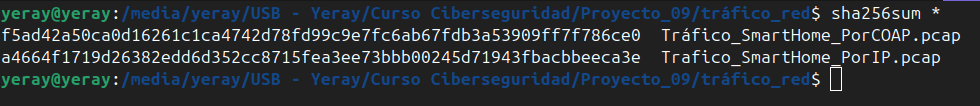
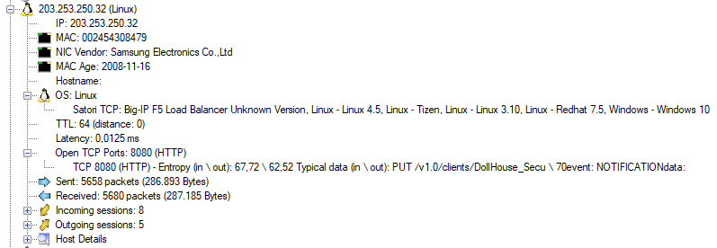
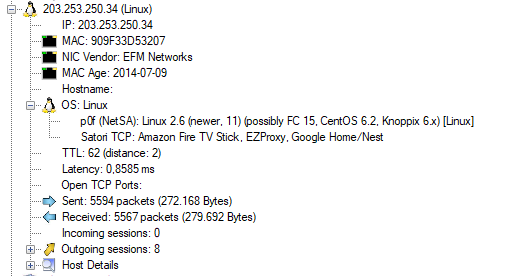
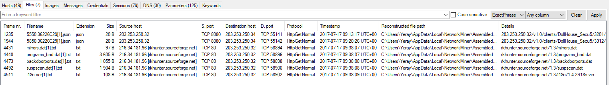
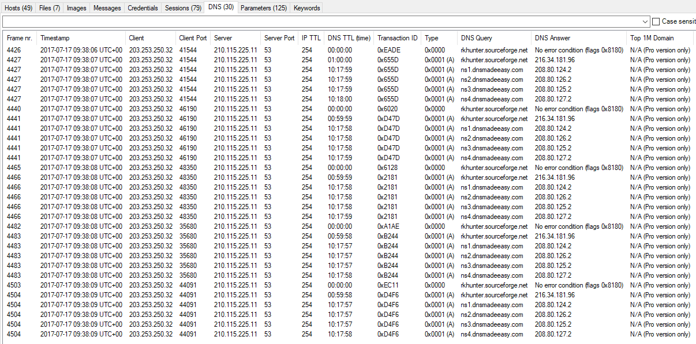

# Toma de nota - Tráfico de red del SmartHome

## Calculo de Hashes

Como primer paso, se realizó la verificación de la integridad de los archivos obtenidos del volcado físico del dispositivo. Para ello, se calcularon los hashes SHA256 de todos los archivos y se compararon con los valores originales proporcionados.

Calculo del hash SHA256:



Hashes originales:

```txt
67ab09760148a66402aa7d9b0abaa322,f5ad42a50ca0d16261c1ca4742d78fd99c9e7fc6ab67fdb3a53909ff7f786ce0,Tráfico_SmartHome_PorCOAP.pcap
8fb0edb521c9ad191adf55054203a6f4,a4664f1719d26382edd6d352cc8715fea3ee73bbb00245d71943fbacbbeeca3e,Trafico_SmartHome_PorIP.pcap
```

Verificando los resultados muestran que los hashes SHA256 coinciden perfectamente con los originales, lo que garantiza que los archivos analizados no han sido modificados ni alterados durante el proceso de adquisición.

## Investigación y Análisis

Se ha utilizado la herramienta [NetworkMiner 3.0](https://www.netresec.com/?page=NetworkMiner) para esta investigacion.

Se ha econtrado dos direcciones IP la `203.253.250.32` asociada a un dispositivo de Samsung.



Y tambien se a encontrado la IP `203.253.250.34` asociada a la empresa surcoreana de telecomunicaciones EFM Networks-



Vemos que lo ha identificado como estos posibles dispositivos:

- Amazon Fire TV Stick
- EZProxy
- Google Home/Nest

### Archivos Compartidos

Se inspeccionaron también los archivos compartidos detectados durante la captura de red:



Sin embargo, tras su revisión no se encontró información relevante o sensible en ellos.

### Consultas DNS

Por último, se revisaron las consultas DNS realizadas durante la sesión:



Tampoco en esta sección se identificó actividad sospechosa o indicios de comunicaciones con dominios maliciosos.

## Conclusión

El análisis realizado sobre el tráfico de red del entorno domótico no ha permitido identificar información relevante para el caso investigado. No se observaron comunicaciones sospechosas ni indicios de que los dispositivos conectados hubieran sido manipulados de forma intencionada. A lo largo del estudio se logró confirmar que los dispositivos presentes estaban conectados de manera habitual, que los archivos analizados eran auténticos y que el comportamiento general de la red coincidía con el funcionamiento normal de un hogar equipado con tecnología inteligente.
